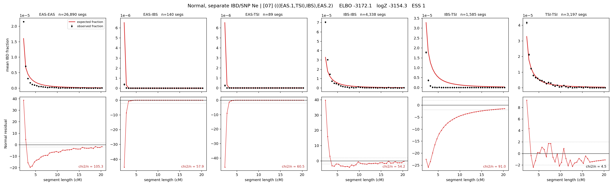

# `(((EAS.1,TSI),IBS),EAS.2)`

**Normal, separate IBD/SNP Ne** | topology 07 of 21 | admixed leaf: **EAS** | 4 events, 8 nodes

## Model score

| quantity | value | |
|---|---|---|
| ELBO | -3172.06 | +- 0.18 (MC) |
| logZ (importance sampling) | -3154.32 | |
| ESS of the IS weights | 1.2 / 4000 | LOW -- treat logZ with suspicion |
| Stan dropped-constant correction | -29.78 | already applied |
| seed kept / runtime | 1 | 18 s |

## Events (in temporal order, most recent first)

| # | type | detail | time (gen) | cumulative |
|---|---|---|---|---|
| 1 | ADMIXTURE | EAS -> EAS.1 + EAS.2 | 1.0 +- 0.0 | 1.0 |
| 2 | MERGE | EAS.2 + TSI -> n1 | 1.0 +- 0.0 | 2.0 |
| 3 | MERGE | n1 + IBS -> n2 | 1.0 +- 0.0 | 3.0 |
| 4 | MERGE | EAS.1 + n2 -> root | 305.4 +- 0.8 | 308.4 |

## Admixture fraction

**f = 1.000 +- 0.000** (fraction from `EAS.1`; 0.000 from `EAS.2`)

Collapsed to a tree: one source carries <5% of the ancestry, so this graph is behaving as its no-admixture special case.

## Effective sizes for IBD (haploid)

| node | Ne | sd of log Ne |
|---|---|---|
| `EAS` | 1,057,810 | 0.03 |
| `IBS` | 384,669 | 0.02 |
| `TSI` | 383,112 | 0.02 |
| `EAS.1` | 1,054,145 | 0.03 |
| `EAS.2` | 382,359 | 0.02 |
| `n1` | 382,137 | 0.02 |
| `n2` | 380,404 | 0.02 |
| `root` | 203 | 0.03 |

log-Ne random-walk step scale tau_ibd = 1.692

## Effective sizes for SNP (haploid)

| node | Ne | sd of log Ne |
|---|---|---|
| `EAS` | 3,724 | 0.01 |
| `IBS` | 3,116 | 0.01 |
| `TSI` | 3,116 | 0.01 |
| `EAS.1` | 3,724 | 0.01 |
| `EAS.2` | 3,116 | 0.01 |
| `n1` | 3,116 | 0.01 |
| `n2` | 3,116 | 0.01 |
| `root` | 3,884 | 0.01 |

log-Ne random-walk step scale tau_snp = 0.077

## Fit quality by component

| component | log-likelihood | n terms | chi2/n |
|---|---|---|---|
| IBD | -2,915.7 | 222 | 62.30 |
| SNP | +40.3 | 6 | 1.10 |

IBD chi2/n uses Palamara model-derived Normal variance; SNP chi2/n uses its block SEs. Values near 1 indicate residuals on the modeled noise scale.

## SNP covariance residuals `(w_hat - W_pred)/w_se`

| | EAS | IBS | TSI |
|---|---|---|---|
| **EAS** | -0.17 | +0.23 | +0.10 |
| **IBS** | +0.23 | +0.80 | -1.32 |
| **TSI** | +0.10 | -1.32 | +1.05 |

