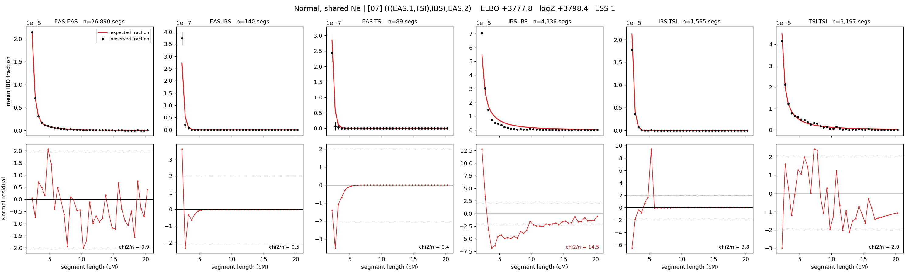

# `(((EAS.1,TSI),IBS),EAS.2)`

**Normal, shared Ne** | topology 07 of 21 | admixed leaf: **EAS** | 4 events, 8 nodes

## Model score

| quantity | value | |
|---|---|---|
| ELBO | +3777.84 | +- 0.29 (MC) |
| logZ (importance sampling) | +3798.44 | |
| ESS of the IS weights | 1.5 / 4000 | LOW -- treat logZ with suspicion |
| Stan dropped-constant correction | -24.10 | already applied |
| mode kept / MAP start / runtime | 1 / 3 | 19 s |
| mode search | 12/12 MAP starts succeeded | 3 distinct modes evaluated |

## Events (in temporal order, most recent first)

| # | type | detail | time (gen) | cumulative |
|---|---|---|---|---|
| 1 | ADMIXTURE | EAS -> EAS.1 + EAS.2 | 128.2 +- 0.8 | 128.2 |
| 2 | MERGE | EAS.2 + TSI -> n1 | 28.7 +- 0.6 | 156.9 |
| 3 | MERGE | n1 + IBS -> n2 | 1.6 +- 0.0 | 158.4 |
| 4 | MERGE | EAS.1 + n2 -> root | 1,947.1 +- 41.2 | 2,105.6 |

## Admixture fraction

**f = 0.987 +- 0.001** (fraction from `EAS.1`; 0.013 from `EAS.2`)

Collapsed to a tree: one source carries <5% of the ancestry, so this graph is behaving as its no-admixture special case.

## Effective sizes shared by IBD and SNP (haploid)

| node | Ne | sd of log Ne |
|---|---|---|
| `EAS` | 2,570,248 | 0.03 |
| `IBS` | 289,643 | 0.04 |
| `TSI` | 426,248 | 0.04 |
| `EAS.1` | 42,690 | 0.02 |
| `EAS.2` | 40,422 | 0.09 |
| `n1` | 16,835 | 0.03 |
| `n2` | 13,950 | 0.02 |
| `root` | 16,587 | 0.04 |

log-Ne random-walk step scale tau = 1.338

## Fit quality by component

| component | log-likelihood | n terms | chi2/n |
|---|---|---|---|
| IBD | +3,886.0 | 222 | 3.78 |
| SNP | +31.1 | 6 | 4.17 |

IBD chi2/n uses Palamara model-derived Normal variance; SNP chi2/n uses its block SEs. Values near 1 indicate residuals on the modeled noise scale.

## SNP covariance residuals `(w_hat - W_pred)/w_se`

| | EAS | IBS | TSI |
|---|---|---|---|
| **EAS** | -0.27 | +0.37 | +0.16 |
| **IBS** | +0.37 | +1.88 | -2.78 |
| **TSI** | +0.16 | -2.78 | +2.30 |

