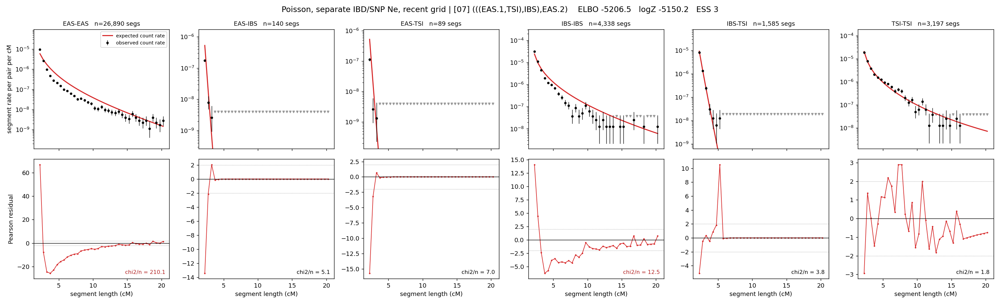

# `(((EAS.1,TSI),IBS),EAS.2)`

**Poisson, separate IBD/SNP Ne, recent grid** | topology 07 of 21 | admixed leaf: **EAS** | 4 events, 8 nodes

> Recent Ne grid: 0-5 and 5-10 generations. The first demographic event is explicitly constrained to occur after generation 10 (minimum 11 with the current one-generation gap).

## Model score

| quantity | value | |
|---|---|---|
| ELBO | -5206.46 | +- 0.72 (MC) |
| logZ (importance sampling) | -5150.15 | |
| ESS of the IS weights | 2.7 / 4000 | LOW -- treat logZ with suspicion |
| Stan dropped-constant correction | -40.81 | already applied |
| seed kept / runtime | 1 | 24 s |

## Events (in temporal order, most recent first)

| # | type | detail | time (gen) | cumulative |
|---|---|---|---|---|
| 1 | ADMIXTURE | EAS -> EAS.1 + EAS.2 | 11.0 +- 0.0 | 11.0 |
| 2 | MERGE | EAS.2 + TSI -> n1 | 148.1 +- 1.6 | 159.1 |
| 3 | MERGE | n1 + IBS -> n2 | 1.0 +- 0.0 | 160.1 |
| 4 | MERGE | EAS.1 + n2 -> root | 153.0 +- 0.8 | 313.1 |

## Admixture fraction

**f = 1.000 +- 0.000** (fraction from `EAS.1`; 0.000 from `EAS.2`)

Collapsed to a tree: one source carries <5% of the ancestry, so this graph is behaving as its no-admixture special case.

## Recent effective sizes for IBD (haploid)

| population | 0-5 gen | 5-10 gen |
|---|---:|---:|
| `EAS` | 72,122,354 | 47,938,242 |
| `IBS` | 4,634,577 | 2,982,679 |
| `TSI` | 1,603,685 | 1,081,052 |

## Effective sizes for IBD (haploid)

| node | Ne | sd of log Ne |
|---|---|---|
| `EAS` | 4,719,141 | 0.02 |
| `IBS` | 293,638 | 0.10 |
| `TSI` | 406,951 | 0.08 |
| `EAS.1` | 820,888 | 0.02 |
| `EAS.2` | 18,907 | 0.03 |
| `n1` | 18,546 | 0.03 |
| `n2` | 14,495 | 0.03 |
| `root` | 1,104 | 0.01 |

log-Ne random-walk step scale tau_ibd = 2.646

## Recent effective sizes for SNP (haploid)

| population | 0-5 gen | 5-10 gen |
|---|---:|---:|
| `EAS` | 25,177 | 21,882 |
| `IBS` | 269,068 | 246,812 |
| `TSI` | 137,233 | 131,899 |

## Effective sizes for SNP (haploid)

| node | Ne | sd of log Ne |
|---|---|---|
| `EAS` | 11,969 | 0.04 |
| `IBS` | 173,636 | 0.06 |
| `TSI` | 119,576 | 0.06 |
| `EAS.1` | 9,812 | 0.04 |
| `EAS.2` | 1,155 | 0.02 |
| `n1` | 1,201 | 0.02 |
| `n2` | 1,028 | 0.02 |
| `root` | 14,505 | 0.01 |

log-Ne random-walk step scale tau_snp = 1.537

## Fit quality by component

| component | log-likelihood | n terms | chi2/n |
|---|---|---|---|
| IBD | -4,880.6 | 222 | 40.30 |
| SNP | +23.3 | 6 | 6.76 |

IBD chi2/n uses Poisson counting variance; SNP chi2/n uses its block SEs. Values near 1 indicate residuals on the modeled noise scale.

## SNP covariance residuals `(w_hat - W_pred)/w_se`

| | EAS | IBS | TSI |
|---|---|---|---|
| **EAS** | +0.05 | -0.59 | +0.50 |
| **IBS** | -0.59 | +0.58 | +0.58 |
| **TSI** | +0.50 | +0.58 | -1.50 |

