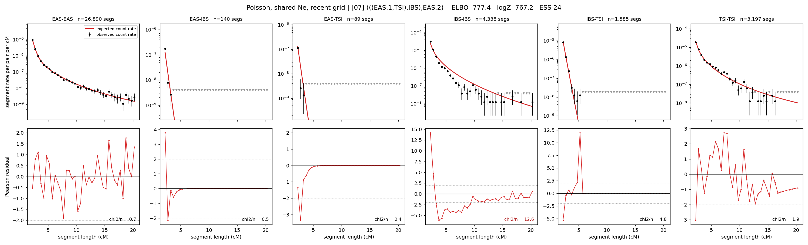

# `(((EAS.1,TSI),IBS),EAS.2)`

**Poisson, shared Ne, recent grid** | topology 07 of 21 | admixed leaf: **EAS** | 4 events, 8 nodes

> Recent Ne grid: 0-5 and 5-10 generations. The first demographic event is explicitly constrained to occur after generation 10 (minimum 11 with the current one-generation gap).

## Model score

| quantity | value | |
|---|---|---|
| ELBO | -777.39 | +- 0.14 (MC) |
| logZ (importance sampling) | -767.25 | |
| ESS of the IS weights | 23.9 / 4000 | LOW -- treat logZ with suspicion |
| Stan dropped-constant correction | -29.61 | already applied |
| mode kept / MAP start / runtime | 1 / 6 | 28 s |
| mode search | 12/12 MAP starts succeeded | 3 distinct modes evaluated |

## Events (in temporal order, most recent first)

| # | type | detail | time (gen) | cumulative |
|---|---|---|---|---|
| 1 | ADMIXTURE | EAS -> EAS.1 + EAS.2 | 136.9 +- 0.7 | 136.9 |
| 2 | MERGE | EAS.2 + TSI -> n1 | 26.4 +- 0.9 | 163.3 |
| 3 | MERGE | n1 + IBS -> n2 | 2.0 +- 0.0 | 165.3 |
| 4 | MERGE | EAS.1 + n2 -> root | 1,580.4 +- 11.9 | 1,745.7 |

## Admixture fraction

**f = 0.987 +- 0.001** (fraction from `EAS.1`; 0.013 from `EAS.2`)

Collapsed to a tree: one source carries <5% of the ancestry, so this graph is behaving as its no-admixture special case.

## Recent effective sizes shared by IBD and SNP (haploid)

| population | 0-5 gen | 5-10 gen |
|---|---:|---:|
| `EAS` | 4,913,468 | 4,933,801 |
| `IBS` | 2,629,297 | 1,791,369 |
| `TSI` | 751,640 | 640,097 |

## Effective sizes shared by IBD and SNP (haploid)

| node | Ne | sd of log Ne |
|---|---|---|
| `EAS` | 2,305,889 | 0.02 |
| `IBS` | 294,498 | 0.03 |
| `TSI` | 416,673 | 0.04 |
| `EAS.1` | 33,054 | 0.03 |
| `EAS.2` | 31,513 | 0.02 |
| `n1` | 16,684 | 0.01 |
| `n2` | 11,499 | 0.01 |
| `root` | 16,727 | 0.00 |

log-Ne random-walk step scale tau = 1.633

## Fit quality by component

| component | log-likelihood | n terms | chi2/n |
|---|---|---|---|
| IBD | -618.1 | 222 | 3.56 |
| SNP | +33.7 | 6 | 3.32 |

IBD chi2/n uses Poisson counting variance; SNP chi2/n uses its block SEs. Values near 1 indicate residuals on the modeled noise scale.

## SNP covariance residuals `(w_hat - W_pred)/w_se`

| | EAS | IBS | TSI |
|---|---|---|---|
| **EAS** | -0.33 | +0.40 | +0.25 |
| **IBS** | +0.40 | +1.85 | -2.80 |
| **TSI** | +0.25 | -2.80 | +2.16 |

