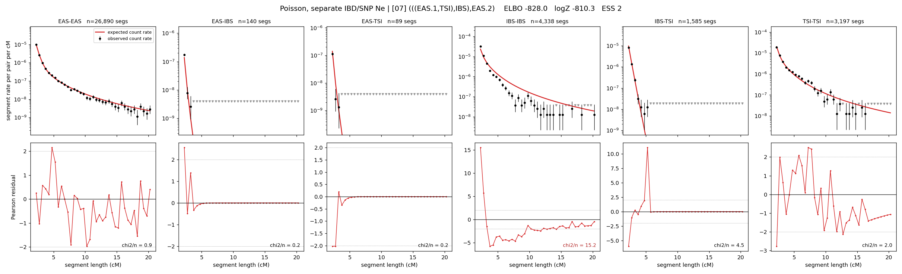

# `(((EAS.1,TSI),IBS),EAS.2)`

**Poisson, separate IBD/SNP Ne** | topology 07 of 21 | admixed leaf: **EAS** | 4 events, 8 nodes

## Model score

| quantity | value | |
|---|---|---|
| ELBO | -827.96 | +- 0.20 (MC) |
| logZ (importance sampling) | -810.29 | |
| ESS of the IS weights | 1.9 / 4000 | LOW -- treat logZ with suspicion |
| Stan dropped-constant correction | -29.78 | already applied |
| mode kept / MAP start / runtime | 1 / 11 | 19 s |
| mode search | 12/12 MAP starts succeeded | 3 distinct modes evaluated |

## Events (in temporal order, most recent first)

| # | type | detail | time (gen) | cumulative |
|---|---|---|---|---|
| 1 | ADMIXTURE | EAS -> EAS.1 + EAS.2 | 126.8 +- 0.8 | 126.8 |
| 2 | MERGE | EAS.2 + TSI -> n1 | 34.9 +- 2.3 | 161.7 |
| 3 | MERGE | n1 + IBS -> n2 | 1.5 +- 0.1 | 163.1 |
| 4 | MERGE | EAS.1 + n2 -> root | 130.6 +- 7.2 | 293.7 |

## Admixture fraction

**f = 0.996 +- 0.001** (fraction from `EAS.1`; 0.004 from `EAS.2`)

Collapsed to a tree: one source carries <5% of the ancestry, so this graph is behaving as its no-admixture special case.

## Effective sizes for IBD (haploid)

| node | Ne | sd of log Ne |
|---|---|---|
| `EAS` | 2,582,977 | 0.03 |
| `IBS` | 314,273 | 0.05 |
| `TSI` | 429,869 | 0.04 |
| `EAS.1` | 45,621 | 0.02 |
| `EAS.2` | 15,771 | 0.08 |
| `n1` | 13,437 | 0.04 |
| `n2` | 12,142 | 0.06 |
| `root` | 11,793 | 0.15 |

log-Ne random-walk step scale tau_ibd = 1.300

## Effective sizes for SNP (haploid)

| node | Ne | sd of log Ne |
|---|---|---|
| `EAS` | 1,249 | 0.09 |
| `IBS` | 119,037 | 0.04 |
| `TSI` | 112,752 | 0.04 |
| `EAS.1` | 2,208 | 0.06 |
| `EAS.2` | 51,109 | 0.02 |
| `n1` | 50,265 | 0.04 |
| `n2` | 50,260 | 0.03 |
| `root` | 13,435 | 0.07 |

log-Ne random-walk step scale tau_snp = 0.844

## Fit quality by component

| component | log-likelihood | n terms | chi2/n |
|---|---|---|---|
| IBD | -685.7 | 222 | 3.94 |
| SNP | +39.4 | 6 | 1.39 |

IBD chi2/n uses Poisson counting variance; SNP chi2/n uses its block SEs. Values near 1 indicate residuals on the modeled noise scale.

## SNP covariance residuals `(w_hat - W_pred)/w_se`

| | EAS | IBS | TSI |
|---|---|---|---|
| **EAS** | -0.02 | +0.04 | +0.00 |
| **IBS** | +0.04 | -0.22 | +0.16 |
| **TSI** | +0.00 | +0.16 | -0.16 |

