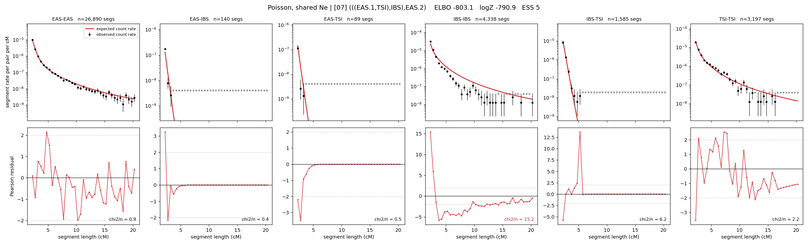

# `(((EAS.1,TSI),IBS),EAS.2)`

**Poisson, shared Ne** | topology 07 of 21 | admixed leaf: **EAS** | 4 events, 8 nodes

## Model score

| quantity | value | |
|---|---|---|
| ELBO | -803.06 | +- 0.14 (MC) |
| logZ (importance sampling) | -790.93 | |
| ESS of the IS weights | 4.9 / 4000 | LOW -- treat logZ with suspicion |
| Stan dropped-constant correction | -24.10 | already applied |
| mode kept / MAP start / runtime | 1 / 6 | 18 s |
| mode search | 10/12 MAP starts succeeded | 3 distinct modes evaluated |

## Events (in temporal order, most recent first)

| # | type | detail | time (gen) | cumulative |
|---|---|---|---|---|
| 1 | ADMIXTURE | EAS -> EAS.1 + EAS.2 | 128.1 +- 1.3 | 128.1 |
| 2 | MERGE | EAS.2 + TSI -> n1 | 38.6 +- 3.5 | 166.7 |
| 3 | MERGE | n1 + IBS -> n2 | 3.3 +- 0.0 | 169.9 |
| 4 | MERGE | EAS.1 + n2 -> root | 1,468.5 +- 93.8 | 1,638.4 |

## Admixture fraction

**f = 0.986 +- 0.001** (fraction from `EAS.1`; 0.014 from `EAS.2`)

Collapsed to a tree: one source carries <5% of the ancestry, so this graph is behaving as its no-admixture special case.

## Effective sizes shared by IBD and SNP (haploid)

| node | Ne | sd of log Ne |
|---|---|---|
| `EAS` | 2,580,328 | 0.04 |
| `IBS` | 313,446 | 0.05 |
| `TSI` | 431,567 | 0.04 |
| `EAS.1` | 42,581 | 0.04 |
| `EAS.2` | 14,420 | 0.08 |
| `n1` | 11,954 | 0.08 |
| `n2` | 9,765 | 0.09 |
| `root` | 17,562 | 0.01 |

log-Ne random-walk step scale tau = 1.158

## Fit quality by component

| component | log-likelihood | n terms | chi2/n |
|---|---|---|---|
| IBD | -701.4 | 222 | 4.34 |
| SNP | +35.3 | 6 | 2.79 |

IBD chi2/n uses Poisson counting variance; SNP chi2/n uses its block SEs. Values near 1 indicate residuals on the modeled noise scale.

## SNP covariance residuals `(w_hat - W_pred)/w_se`

| | EAS | IBS | TSI |
|---|---|---|---|
| **EAS** | -0.30 | +0.31 | +0.29 |
| **IBS** | +0.31 | +1.77 | -2.52 |
| **TSI** | +0.29 | -2.52 | +1.82 |

