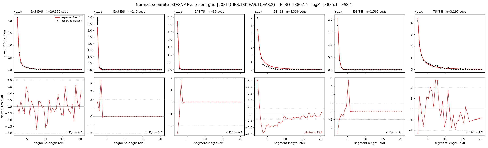

# `(((IBS,TSI),EAS.1),EAS.2)`

**Normal, separate IBD/SNP Ne, recent grid** | topology 08 of 21 | admixed leaf: **EAS** | 4 events, 8 nodes

> Recent Ne grid: 0-5 and 5-10 generations. The first demographic event is explicitly constrained to occur after generation 10 (minimum 11 with the current one-generation gap).

> Graph where the two NON-admixed leaves merge first. Excluded by the 'first merge must involve an admixture branch' rule; included here because it is the standard local-clade + deep-source scenario.

## Model score

| quantity | value | |
|---|---|---|
| ELBO | +3807.42 | +- 0.25 (MC) |
| logZ (importance sampling) | +3835.07 | |
| ESS of the IS weights | 1.0 / 4000 | LOW -- treat logZ with suspicion |
| Stan dropped-constant correction | -40.81 | already applied |
| seed kept / runtime | 13 | 24 s |

## Events (in temporal order, most recent first)

| # | type | detail | time (gen) | cumulative |
|---|---|---|---|---|
| 1 | ADMIXTURE | EAS -> EAS.1 + EAS.2 | 131.1 +- 0.5 | 131.1 |
| 2 | MERGE | IBS + TSI -> n1 | 17.8 +- 0.2 | 148.9 |
| 3 | MERGE | EAS.2 + n1 -> n2 | 151.8 +- 1.5 | 300.7 |
| 4 | MERGE | EAS.1 + n2 -> root | 262.6 +- 12.7 | 563.3 |

## Admixture fraction

**f = 0.788 +- 0.001** (fraction from `EAS.1`; 0.212 from `EAS.2`)

## Recent effective sizes for IBD (haploid)

| population | 0-5 gen | 5-10 gen |
|---|---:|---:|
| `EAS` | 4,600,946 | 4,121,105 |
| `IBS` | 2,268,689 | 1,579,124 |
| `TSI` | 1,051,781 | 795,414 |

## Effective sizes for IBD (haploid)

| node | Ne | sd of log Ne |
|---|---|---|
| `EAS` | 2,411,022 | 0.04 |
| `IBS` | 274,601 | 0.03 |
| `TSI` | 405,383 | 0.05 |
| `EAS.1` | 281,784 | 0.09 |
| `EAS.2` | 1,971 | 0.02 |
| `n1` | 21,212 | 0.03 |
| `n2` | 1,285 | 0.02 |
| `root` | 15,106 | 0.01 |

log-Ne random-walk step scale tau_ibd = 1.787

## Recent effective sizes for SNP (haploid)

| population | 0-5 gen | 5-10 gen |
|---|---:|---:|
| `EAS` | 6,243 | 6,115 |
| `IBS` | 156,281 | 146,914 |
| `TSI` | 114,032 | 109,831 |

## Effective sizes for SNP (haploid)

| node | Ne | sd of log Ne |
|---|---|---|
| `EAS` | 5,611 | 0.03 |
| `IBS` | 111,807 | 0.07 |
| `TSI` | 100,133 | 0.05 |
| `EAS.1` | 2,247 | 0.01 |
| `EAS.2` | 6,533 | 0.15 |
| `n1` | 34,241 | 0.08 |
| `n2` | 5,222 | 0.17 |
| `root` | 9,966 | 0.04 |

log-Ne random-walk step scale tau_snp = 0.798

## Fit quality by component

| component | log-likelihood | n terms | chi2/n |
|---|---|---|---|
| IBD | +4,034.3 | 222 | 3.12 |
| SNP | +40.0 | 6 | 1.21 |

IBD chi2/n uses Palamara model-derived Normal variance; SNP chi2/n uses its block SEs. Values near 1 indicate residuals on the modeled noise scale.

## SNP covariance residuals `(w_hat - W_pred)/w_se`

| | EAS | IBS | TSI |
|---|---|---|---|
| **EAS** | +0.01 | -0.02 | +0.01 |
| **IBS** | -0.02 | -0.07 | +0.13 |
| **TSI** | +0.01 | +0.13 | -0.14 |

