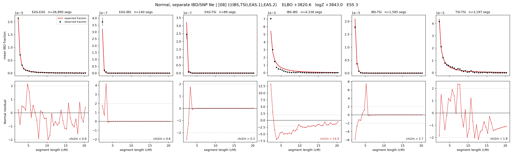

# `(((IBS,TSI),EAS.1),EAS.2)`

**Normal, separate IBD/SNP Ne** | topology 08 of 21 | admixed leaf: **EAS** | 4 events, 8 nodes

> Graph where the two NON-admixed leaves merge first. Excluded by the 'first merge must involve an admixture branch' rule; included here because it is the standard local-clade + deep-source scenario.

## Model score

| quantity | value | |
|---|---|---|
| ELBO | +3820.58 | +- 0.34 (MC) |
| logZ (importance sampling) | +3843.00 | |
| ESS of the IS weights | 3.4 / 4000 | LOW -- treat logZ with suspicion |
| Stan dropped-constant correction | -29.78 | already applied |
| mode kept / MAP start / runtime | 3 / 3 | 21 s |
| mode search | 12/12 MAP starts succeeded | 3 distinct modes evaluated |

## Events (in temporal order, most recent first)

| # | type | detail | time (gen) | cumulative |
|---|---|---|---|---|
| 1 | ADMIXTURE | EAS -> EAS.1 + EAS.2 | 126.5 +- 0.4 | 126.5 |
| 2 | MERGE | IBS + TSI -> n1 | 23.7 +- 0.2 | 150.2 |
| 3 | MERGE | EAS.2 + n1 -> n2 | 143.9 +- 1.0 | 294.1 |
| 4 | MERGE | EAS.1 + n2 -> root | 13.2 +- 0.4 | 307.2 |

## Admixture fraction

**f = 0.197 +- 0.001** (fraction from `EAS.1`; 0.803 from `EAS.2`)

## Effective sizes for IBD (haploid)

| node | Ne | sd of log Ne |
|---|---|---|
| `EAS` | 2,588,090 | 0.04 |
| `IBS` | 288,314 | 0.04 |
| `TSI` | 424,235 | 0.08 |
| `EAS.1` | 2,026 | 0.02 |
| `EAS.2` | 251,132 | 0.02 |
| `n1` | 18,780 | 0.03 |
| `n2` | 8,348 | 0.02 |
| `root` | 6,873 | 0.01 |

log-Ne random-walk step scale tau_ibd = 1.227

## Effective sizes for SNP (haploid)

| node | Ne | sd of log Ne |
|---|---|---|
| `EAS` | 1,042 | 0.01 |
| `IBS` | 111,280 | 0.05 |
| `TSI` | 104,318 | 0.06 |
| `EAS.1` | 11,775 | 0.01 |
| `EAS.2` | 1,947 | 0.01 |
| `n1` | 52,683 | 0.03 |
| `n2` | 14,217 | 0.00 |
| `root` | 14,563 | 0.00 |

log-Ne random-walk step scale tau_snp = 0.802

## Fit quality by component

| component | log-likelihood | n terms | chi2/n |
|---|---|---|---|
| IBD | +3,960.2 | 222 | 3.66 |
| SNP | +39.0 | 6 | 1.54 |

IBD chi2/n uses Palamara model-derived Normal variance; SNP chi2/n uses its block SEs. Values near 1 indicate residuals on the modeled noise scale.

## SNP covariance residuals `(w_hat - W_pred)/w_se`

| | EAS | IBS | TSI |
|---|---|---|---|
| **EAS** | +0.03 | -0.01 | -0.05 |
| **IBS** | -0.01 | -0.13 | +0.15 |
| **TSI** | -0.05 | +0.15 | -0.06 |

