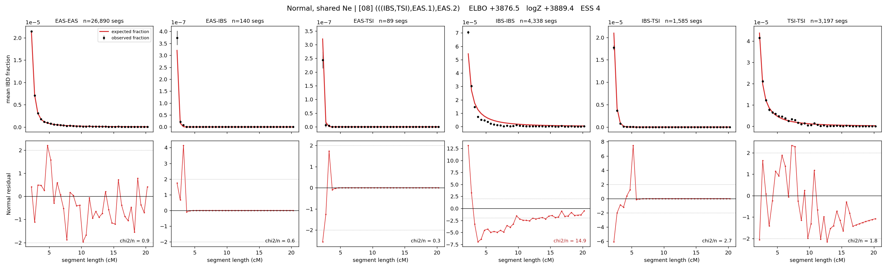

# `(((IBS,TSI),EAS.1),EAS.2)`

**Normal, shared Ne** | topology 08 of 21 | admixed leaf: **EAS** | 4 events, 8 nodes

> Graph where the two NON-admixed leaves merge first. Excluded by the 'first merge must involve an admixture branch' rule; included here because it is the standard local-clade + deep-source scenario.

## Model score

| quantity | value | |
|---|---|---|
| ELBO | +3876.47 | +- 0.22 (MC) |
| logZ (importance sampling) | +3889.35 | |
| ESS of the IS weights | 3.7 / 4000 | LOW -- treat logZ with suspicion |
| Stan dropped-constant correction | -24.10 | already applied |
| mode kept / MAP start / runtime | 1 / 6 | 20 s |
| mode search | 12/12 MAP starts succeeded | 3 distinct modes evaluated |

## Events (in temporal order, most recent first)

| # | type | detail | time (gen) | cumulative |
|---|---|---|---|---|
| 1 | ADMIXTURE | EAS -> EAS.1 + EAS.2 | 127.1 +- 0.5 | 127.1 |
| 2 | MERGE | IBS + TSI -> n1 | 22.1 +- 1.6 | 149.2 |
| 3 | MERGE | EAS.2 + n1 -> n2 | 147.7 +- 2.0 | 296.9 |
| 4 | MERGE | EAS.1 + n2 -> root | 288.2 +- 3.7 | 585.0 |

## Admixture fraction

**f = 0.832 +- 0.012** (fraction from `EAS.1`; 0.168 from `EAS.2`)

## Effective sizes shared by IBD and SNP (haploid)

| node | Ne | sd of log Ne |
|---|---|---|
| `EAS` | 2,593,152 | 0.03 |
| `IBS` | 287,082 | 0.02 |
| `TSI` | 420,209 | 0.05 |
| `EAS.1` | 564,321 | 0.17 |
| `EAS.2` | 1,333 | 0.15 |
| `n1` | 20,920 | 0.04 |
| `n2` | 1,173 | 0.02 |
| `root` | 14,000 | 0.08 |

log-Ne random-walk step scale tau = 1.197

## Fit quality by component

| component | log-likelihood | n terms | chi2/n |
|---|---|---|---|
| IBD | +3,962.9 | 222 | 3.63 |
| SNP | +31.7 | 6 | 3.97 |

IBD chi2/n uses Palamara model-derived Normal variance; SNP chi2/n uses its block SEs. Values near 1 indicate residuals on the modeled noise scale.

## SNP covariance residuals `(w_hat - W_pred)/w_se`

| | EAS | IBS | TSI |
|---|---|---|---|
| **EAS** | -0.35 | +0.48 | +0.20 |
| **IBS** | +0.48 | +1.93 | -3.05 |
| **TSI** | +0.20 | -3.05 | +2.48 |

