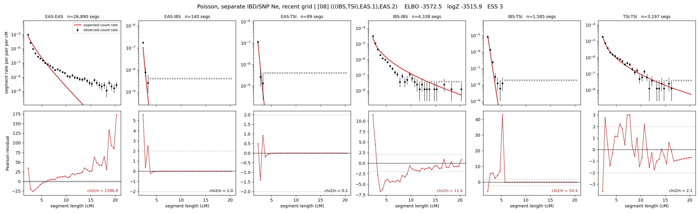

# `(((IBS,TSI),EAS.1),EAS.2)`

**Poisson, separate IBD/SNP Ne, recent grid** | topology 08 of 21 | admixed leaf: **EAS** | 4 events, 8 nodes

> Recent Ne grid: 0-5 and 5-10 generations. The first demographic event is explicitly constrained to occur after generation 10 (minimum 11 with the current one-generation gap).

> Graph where the two NON-admixed leaves merge first. Excluded by the 'first merge must involve an admixture branch' rule; included here because it is the standard local-clade + deep-source scenario.

## Model score

| quantity | value | |
|---|---|---|
| ELBO | -3572.52 | +- 1.01 (MC) |
| logZ (importance sampling) | -3515.95 | |
| ESS of the IS weights | 3.5 / 4000 | LOW -- treat logZ with suspicion |
| Stan dropped-constant correction | -40.81 | already applied |
| seed kept / runtime | 1 | 30 s |

## Events (in temporal order, most recent first)

| # | type | detail | time (gen) | cumulative |
|---|---|---|---|---|
| 1 | ADMIXTURE | EAS -> EAS.1 + EAS.2 | 38.0 +- 2.1 | 38.0 |
| 2 | MERGE | IBS + TSI -> n1 | 168.1 +- 0.3 | 206.1 |
| 3 | MERGE | EAS.2 + n1 -> n2 | 8.1 +- 0.1 | 214.2 |
| 4 | MERGE | EAS.1 + n2 -> root | 96.8 +- 0.2 | 311.1 |

## Admixture fraction

**f = 0.994 +- 0.000** (fraction from `EAS.1`; 0.006 from `EAS.2`)

Collapsed to a tree: one source carries <5% of the ancestry, so this graph is behaving as its no-admixture special case.

## Recent effective sizes for IBD (haploid)

| population | 0-5 gen | 5-10 gen |
|---|---:|---:|
| `EAS` | 257,753,432,165,250 | 130,531,261,414,500 |
| `IBS` | 20,368,609 | 10,626,675 |
| `TSI` | 3,352,005 | 1,820,902 |

## Effective sizes for IBD (haploid)

| node | Ne | sd of log Ne |
|---|---|---|
| `EAS` | 1,826,677,352,502 | 0.55 |
| `IBS` | 278,393 | 0.05 |
| `TSI` | 400,335 | 0.06 |
| `EAS.1` | 457,177 | 0.03 |
| `EAS.2` | 1,475 | 0.04 |
| `n1` | 4,455 | 0.02 |
| `n2` | 2,470 | 0.02 |
| `root` | 11,425 | 0.01 |

log-Ne random-walk step scale tau_ibd = 3.990

## Recent effective sizes for SNP (haploid)

| population | 0-5 gen | 5-10 gen |
|---|---:|---:|
| `EAS` | 1,010 | 1,034 |
| `IBS` | 49,492 | 50,702 |
| `TSI` | 330,665 | 337,352 |

## Effective sizes for SNP (haploid)

| node | Ne | sd of log Ne |
|---|---|---|
| `EAS` | 1,186 | 0.02 |
| `IBS` | 57,493 | 0.02 |
| `TSI` | 355,572 | 0.02 |
| `EAS.1` | 1,865 | 0.01 |
| `EAS.2` | 40,440 | 0.01 |
| `n1` | 68,876 | 0.01 |
| `n2` | 54,845 | 0.01 |
| `root` | 31,038 | 0.00 |

log-Ne random-walk step scale tau_snp = 0.717

## Fit quality by component

| component | log-likelihood | n terms | chi2/n |
|---|---|---|---|
| IBD | -3,193.7 | 222 | 614.01 |
| SNP | +22.5 | 6 | 7.05 |

IBD chi2/n uses Poisson counting variance; SNP chi2/n uses its block SEs. Values near 1 indicate residuals on the modeled noise scale.

## SNP covariance residuals `(w_hat - W_pred)/w_se`

| | EAS | IBS | TSI |
|---|---|---|---|
| **EAS** | +0.10 | +1.42 | -1.62 |
| **IBS** | +1.42 | -4.83 | +2.27 |
| **TSI** | -1.62 | +2.27 | +0.96 |

