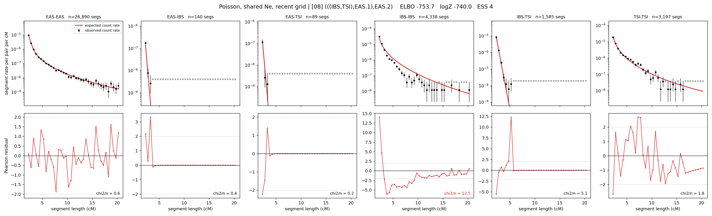

# `(((IBS,TSI),EAS.1),EAS.2)`

**Poisson, shared Ne, recent grid** | topology 08 of 21 | admixed leaf: **EAS** | 4 events, 8 nodes

> Recent Ne grid: 0-5 and 5-10 generations. The first demographic event is explicitly constrained to occur after generation 10 (minimum 11 with the current one-generation gap).

> Graph where the two NON-admixed leaves merge first. Excluded by the 'first merge must involve an admixture branch' rule; included here because it is the standard local-clade + deep-source scenario.

## Model score

| quantity | value | |
|---|---|---|
| ELBO | -753.71 | +- 0.16 (MC) |
| logZ (importance sampling) | -740.04 | |
| ESS of the IS weights | 3.8 / 4000 | LOW -- treat logZ with suspicion |
| Stan dropped-constant correction | -29.61 | already applied |
| mode kept / MAP start / runtime | 1 / 9 | 28 s |
| mode search | 12/12 MAP starts succeeded | 3 distinct modes evaluated |

## Events (in temporal order, most recent first)

| # | type | detail | time (gen) | cumulative |
|---|---|---|---|---|
| 1 | ADMIXTURE | EAS -> EAS.1 + EAS.2 | 153.7 +- 0.3 | 153.7 |
| 2 | MERGE | IBS + TSI -> n1 | 12.6 +- 0.1 | 166.3 |
| 3 | MERGE | EAS.2 + n1 -> n2 | 111.8 +- 0.4 | 278.1 |
| 4 | MERGE | EAS.1 + n2 -> root | 236.3 +- 0.7 | 514.4 |

## Admixture fraction

**f = 0.040 +- 0.000** (fraction from `EAS.1`; 0.960 from `EAS.2`)

Collapsed to a tree: one source carries <5% of the ancestry, so this graph is behaving as its no-admixture special case.

## Recent effective sizes shared by IBD and SNP (haploid)

| population | 0-5 gen | 5-10 gen |
|---|---:|---:|
| `EAS` | 4,546,765 | 4,257,129 |
| `IBS` | 2,343,508 | 1,557,818 |
| `TSI` | 1,020,418 | 670,906 |

## Effective sizes shared by IBD and SNP (haploid)

| node | Ne | sd of log Ne |
|---|---|---|
| `EAS` | 2,363,003 | 0.03 |
| `IBS` | 294,781 | 0.03 |
| `TSI` | 409,298 | 0.04 |
| `EAS.1` | 3 | 0.02 |
| `EAS.2` | 463,497 | 0.02 |
| `n1` | 10,993 | 0.02 |
| `n2` | 14,170 | 0.01 |
| `root` | 11,695 | 0.00 |

log-Ne random-walk step scale tau = 1.909

## Fit quality by component

| component | log-likelihood | n terms | chi2/n |
|---|---|---|---|
| IBD | -601.8 | 222 | 3.50 |
| SNP | +28.8 | 6 | 4.95 |

IBD chi2/n uses Poisson counting variance; SNP chi2/n uses its block SEs. Values near 1 indicate residuals on the modeled noise scale.

## SNP covariance residuals `(w_hat - W_pred)/w_se`

| | EAS | IBS | TSI |
|---|---|---|---|
| **EAS** | -0.37 | +0.49 | +0.24 |
| **IBS** | +0.49 | +1.85 | -2.99 |
| **TSI** | +0.24 | -2.99 | +2.36 |

