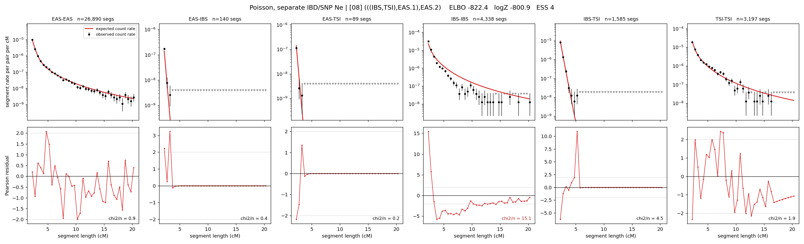

# `(((IBS,TSI),EAS.1),EAS.2)`

**Poisson, separate IBD/SNP Ne** | topology 08 of 21 | admixed leaf: **EAS** | 4 events, 8 nodes

> Graph where the two NON-admixed leaves merge first. Excluded by the 'first merge must involve an admixture branch' rule; included here because it is the standard local-clade + deep-source scenario.

## Model score

| quantity | value | |
|---|---|---|
| ELBO | -822.36 | +- 0.33 (MC) |
| logZ (importance sampling) | -800.93 | |
| ESS of the IS weights | 4.2 / 4000 | LOW -- treat logZ with suspicion |
| Stan dropped-constant correction | -29.78 | already applied |
| mode kept / MAP start / runtime | 2 / 2 | 19 s |
| mode search | 12/12 MAP starts succeeded | 3 distinct modes evaluated |

## Events (in temporal order, most recent first)

| # | type | detail | time (gen) | cumulative |
|---|---|---|---|---|
| 1 | ADMIXTURE | EAS -> EAS.1 + EAS.2 | 127.2 +- 0.4 | 127.2 |
| 2 | MERGE | IBS + TSI -> n1 | 35.6 +- 0.8 | 162.8 |
| 3 | MERGE | EAS.2 + n1 -> n2 | 113.0 +- 0.4 | 275.8 |
| 4 | MERGE | EAS.1 + n2 -> root | 84.1 +- 4.6 | 359.9 |

## Admixture fraction

**f = 0.042 +- 0.002** (fraction from `EAS.1`; 0.958 from `EAS.2`)

Collapsed to a tree: one source carries <5% of the ancestry, so this graph is behaving as its no-admixture special case.

## Effective sizes for IBD (haploid)

| node | Ne | sd of log Ne |
|---|---|---|
| `EAS` | 2,578,943 | 0.06 |
| `IBS` | 315,340 | 0.05 |
| `TSI` | 424,925 | 0.04 |
| `EAS.1` | 17,476 | 0.01 |
| `EAS.2` | 41,891 | 0.01 |
| `n1` | 12,125 | 0.01 |
| `n2` | 15,482 | 0.01 |
| `root` | 15,599 | 0.01 |

log-Ne random-walk step scale tau_ibd = 1.237

## Effective sizes for SNP (haploid)

| node | Ne | sd of log Ne |
|---|---|---|
| `EAS` | 1,015 | 0.01 |
| `IBS` | 131,333 | 0.06 |
| `TSI` | 105,715 | 0.05 |
| `EAS.1` | 13,047 | 0.05 |
| `EAS.2` | 2,596 | 0.01 |
| `n1` | 45,798 | 0.03 |
| `n2` | 14,023 | 0.01 |
| `root` | 14,294 | 0.01 |

log-Ne random-walk step scale tau_snp = 0.822

## Fit quality by component

| component | log-likelihood | n terms | chi2/n |
|---|---|---|---|
| IBD | -689.3 | 222 | 3.98 |
| SNP | +38.8 | 6 | 1.61 |

IBD chi2/n uses Poisson counting variance; SNP chi2/n uses its block SEs. Values near 1 indicate residuals on the modeled noise scale.

## SNP covariance residuals `(w_hat - W_pred)/w_se`

| | EAS | IBS | TSI |
|---|---|---|---|
| **EAS** | +0.02 | -0.10 | +0.07 |
| **IBS** | -0.10 | +0.07 | +0.12 |
| **TSI** | +0.07 | +0.12 | -0.24 |

