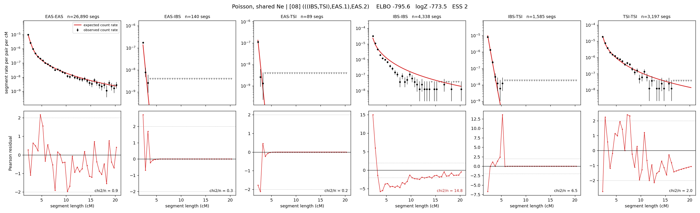

# `(((IBS,TSI),EAS.1),EAS.2)`

**Poisson, shared Ne** | topology 08 of 21 | admixed leaf: **EAS** | 4 events, 8 nodes

> Graph where the two NON-admixed leaves merge first. Excluded by the 'first merge must involve an admixture branch' rule; included here because it is the standard local-clade + deep-source scenario.

## Model score

| quantity | value | |
|---|---|---|
| ELBO | -795.59 | +- 0.31 (MC) |
| logZ (importance sampling) | -773.54 | |
| ESS of the IS weights | 2.1 / 4000 | LOW -- treat logZ with suspicion |
| Stan dropped-constant correction | -24.10 | already applied |
| mode kept / MAP start / runtime | 1 / 6 | 17 s |
| mode search | 10/12 MAP starts succeeded | 3 distinct modes evaluated |

## Events (in temporal order, most recent first)

| # | type | detail | time (gen) | cumulative |
|---|---|---|---|---|
| 1 | ADMIXTURE | EAS -> EAS.1 + EAS.2 | 127.5 +- 0.6 | 127.5 |
| 2 | MERGE | IBS + TSI -> n1 | 41.7 +- 0.2 | 169.2 |
| 3 | MERGE | EAS.2 + n1 -> n2 | 63.5 +- 0.8 | 232.7 |
| 4 | MERGE | EAS.1 + n2 -> root | 1,209.8 +- 10.7 | 1,442.4 |

## Admixture fraction

**f = 0.913 +- 0.001** (fraction from `EAS.1`; 0.087 from `EAS.2`)

## Effective sizes shared by IBD and SNP (haploid)

| node | Ne | sd of log Ne |
|---|---|---|
| `EAS` | 2,584,539 | 0.04 |
| `IBS` | 314,074 | 0.03 |
| `TSI` | 422,754 | 0.03 |
| `EAS.1` | 38,973 | 0.02 |
| `EAS.2` | 7,356 | 0.01 |
| `n1` | 10,268 | 0.02 |
| `n2` | 6,860 | 0.01 |
| `root` | 8,943 | 0.01 |

log-Ne random-walk step scale tau = 1.445

## Fit quality by component

| component | log-likelihood | n terms | chi2/n |
|---|---|---|---|
| IBD | -686.1 | 222 | 4.20 |
| SNP | +26.1 | 6 | 5.85 |

IBD chi2/n uses Poisson counting variance; SNP chi2/n uses its block SEs. Values near 1 indicate residuals on the modeled noise scale.

## SNP covariance residuals `(w_hat - W_pred)/w_se`

| | EAS | IBS | TSI |
|---|---|---|---|
| **EAS** | -0.35 | +0.48 | +0.22 |
| **IBS** | +0.48 | +1.86 | -2.96 |
| **TSI** | +0.22 | -2.96 | +2.37 |

