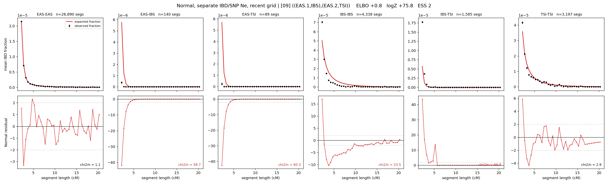

# `((EAS.1,IBS),(EAS.2,TSI))`

**Normal, separate IBD/SNP Ne, recent grid** | topology 09 of 21 | admixed leaf: **EAS** | 4 events, 8 nodes

> Recent Ne grid: 0-5 and 5-10 generations. The first demographic event is explicitly constrained to occur after generation 10 (minimum 11 with the current one-generation gap).

## Model score

| quantity | value | |
|---|---|---|
| ELBO | +0.84 | +- 1.01 (MC) |
| logZ (importance sampling) | +75.84 | |
| ESS of the IS weights | 2.2 / 4000 | LOW -- treat logZ with suspicion |
| Stan dropped-constant correction | -40.81 | already applied |
| seed kept / runtime | 13 | 24 s |

## Events (in temporal order, most recent first)

| # | type | detail | time (gen) | cumulative |
|---|---|---|---|---|
| 1 | ADMIXTURE | EAS -> EAS.1 + EAS.2 | 129.8 +- 2.1 | 129.8 |
| 2 | MERGE | EAS.1 + IBS -> n1 | 16.2 +- 2.5 | 146.0 |
| 3 | MERGE | EAS.2 + TSI -> n2 | 1.0 +- 0.0 | 147.1 |
| 4 | MERGE | n1 + n2 -> root | 1.0 +- 0.0 | 148.1 |

## Admixture fraction

**f = 0.998 +- 0.001** (fraction from `EAS.1`; 0.002 from `EAS.2`)

Collapsed to a tree: one source carries <5% of the ancestry, so this graph is behaving as its no-admixture special case.

## Recent effective sizes for IBD (haploid)

| population | 0-5 gen | 5-10 gen |
|---|---:|---:|
| `EAS` | 4,573,461 | 3,366,319 |
| `IBS` | 3,342,977 | 2,160,210 |
| `TSI` | 3,122,703 | 1,827,339 |

## Effective sizes for IBD (haploid)

| node | Ne | sd of log Ne |
|---|---|---|
| `EAS` | 2,589,700 | 0.08 |
| `IBS` | 211,707 | 0.02 |
| `TSI` | 321,809 | 0.09 |
| `EAS.1` | 25,223 | 0.18 |
| `EAS.2` | 36,688 | 0.21 |
| `n1` | 359,258 | 0.09 |
| `n2` | 36,699 | 0.21 |
| `root` | 73,271 | 0.02 |

log-Ne random-walk step scale tau_ibd = 2.334

## Recent effective sizes for SNP (haploid)

| population | 0-5 gen | 5-10 gen |
|---|---:|---:|
| `EAS` | 861 | 764 |
| `IBS` | 153,243 | 145,018 |
| `TSI` | 102,621 | 98,756 |

## Effective sizes for SNP (haploid)

| node | Ne | sd of log Ne |
|---|---|---|
| `EAS` | 741 | 0.03 |
| `IBS` | 105,352 | 0.09 |
| `TSI` | 111,745 | 0.08 |
| `EAS.1` | 3,683 | 0.65 |
| `EAS.2` | 13,926 | 0.19 |
| `n1` | 17,134 | 0.09 |
| `n2` | 13,934 | 0.19 |
| `root` | 16,724 | 0.11 |

log-Ne random-walk step scale tau_snp = 1.020

## Fit quality by component

| component | log-likelihood | n terms | chi2/n |
|---|---|---|---|
| IBD | +292.2 | 222 | 35.75 |
| SNP | +29.6 | 6 | 4.67 |

IBD chi2/n uses Palamara model-derived Normal variance; SNP chi2/n uses its block SEs. Values near 1 indicate residuals on the modeled noise scale.

## SNP covariance residuals `(w_hat - W_pred)/w_se`

| | EAS | IBS | TSI |
|---|---|---|---|
| **EAS** | -0.02 | +0.00 | +0.03 |
| **IBS** | +0.00 | -0.25 | +0.26 |
| **TSI** | +0.03 | +0.26 | -0.30 |

