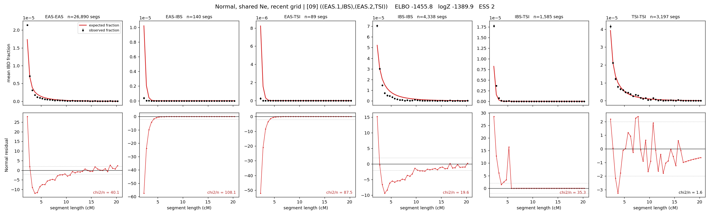

# `((EAS.1,IBS),(EAS.2,TSI))`

**Normal, shared Ne, recent grid** | topology 09 of 21 | admixed leaf: **EAS** | 4 events, 8 nodes

> Recent Ne grid: 0-5 and 5-10 generations. The first demographic event is explicitly constrained to occur after generation 10 (minimum 11 with the current one-generation gap).

## Model score

| quantity | value | |
|---|---|---|
| ELBO | -1455.81 | +- 1.07 (MC) |
| logZ (importance sampling) | -1389.94 | |
| ESS of the IS weights | 1.9 / 4000 | LOW -- treat logZ with suspicion |
| Stan dropped-constant correction | -29.61 | already applied |
| mode kept / MAP start / runtime | 1 / 11 | 124 s |
| mode search | 12/12 MAP starts succeeded | 3 distinct modes evaluated |

## Events (in temporal order, most recent first)

| # | type | detail | time (gen) | cumulative |
|---|---|---|---|---|
| 1 | ADMIXTURE | EAS -> EAS.1 + EAS.2 | 11.1 +- 0.0 | 11.1 |
| 2 | MERGE | EAS.1 + IBS -> n1 | 147.3 +- 0.4 | 158.4 |
| 3 | MERGE | EAS.2 + TSI -> n2 | 1.2 +- 0.0 | 159.6 |
| 4 | MERGE | n1 + n2 -> root | 1.0 +- 0.0 | 160.6 |

## Admixture fraction

**f = 0.999 +- 0.000** (fraction from `EAS.1`; 0.001 from `EAS.2`)

Collapsed to a tree: one source carries <5% of the ancestry, so this graph is behaving as its no-admixture special case.

## Recent effective sizes shared by IBD and SNP (haploid)

| population | 0-5 gen | 5-10 gen |
|---|---:|---:|
| `EAS` | 50,404,800 | 50,414,045 |
| `IBS` | 1,585,607 | 2,240,085 |
| `TSI` | 6,028,490 | 3,813,896 |

## Effective sizes shared by IBD and SNP (haploid)

| node | Ne | sd of log Ne |
|---|---|---|
| `EAS` | 6,026,929 | 0.03 |
| `IBS` | 230,518 | 0.09 |
| `TSI` | 349,955 | 0.10 |
| `EAS.1` | 1,340,530 | 0.03 |
| `EAS.2` | 0 | 0.03 |
| `n1` | 10,445 | 0.03 |
| `n2` | 2,769 | 0.04 |
| `root` | 33,635 | 0.04 |

log-Ne random-walk step scale tau = 3.953

## Fit quality by component

| component | log-likelihood | n terms | chi2/n |
|---|---|---|---|
| IBD | -1,166.0 | 222 | 49.00 |
| SNP | +14.8 | 6 | 9.61 |

IBD chi2/n uses Palamara model-derived Normal variance; SNP chi2/n uses its block SEs. Values near 1 indicate residuals on the modeled noise scale.

## SNP covariance residuals `(w_hat - W_pred)/w_se`

| | EAS | IBS | TSI |
|---|---|---|---|
| **EAS** | -0.24 | +0.13 | +0.34 |
| **IBS** | +0.13 | +1.42 | -1.79 |
| **TSI** | +0.34 | -1.79 | +1.03 |

