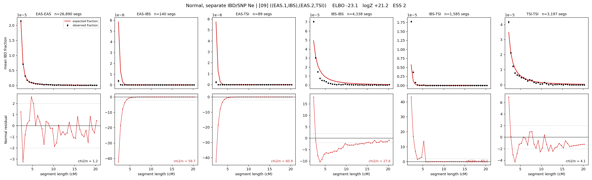

# `((EAS.1,IBS),(EAS.2,TSI))`

**Normal, separate IBD/SNP Ne** | topology 09 of 21 | admixed leaf: **EAS** | 4 events, 8 nodes

## Model score

| quantity | value | |
|---|---|---|
| ELBO | -23.12 | +- 0.79 (MC) |
| logZ (importance sampling) | +21.23 | |
| ESS of the IS weights | 1.9 / 4000 | LOW -- treat logZ with suspicion |
| Stan dropped-constant correction | -29.78 | already applied |
| seed kept / runtime | 7 | 18 s |

## Events (in temporal order, most recent first)

| # | type | detail | time (gen) | cumulative |
|---|---|---|---|---|
| 1 | ADMIXTURE | EAS -> EAS.1 + EAS.2 | 128.3 +- 1.0 | 128.3 |
| 2 | MERGE | EAS.1 + IBS -> n1 | 18.1 +- 0.7 | 146.4 |
| 3 | MERGE | EAS.2 + TSI -> n2 | 1.0 +- 0.0 | 147.4 |
| 4 | MERGE | n1 + n2 -> root | 1.0 +- 0.0 | 148.4 |

## Admixture fraction

**f = 0.996 +- 0.000** (fraction from `EAS.1`; 0.004 from `EAS.2`)

Collapsed to a tree: one source carries <5% of the ancestry, so this graph is behaving as its no-admixture special case.

## Effective sizes for IBD (haploid)

| node | Ne | sd of log Ne |
|---|---|---|
| `EAS` | 2,672,138 | 0.06 |
| `IBS` | 219,910 | 0.04 |
| `TSI` | 332,894 | 0.07 |
| `EAS.1` | 28,254 | 0.06 |
| `EAS.2` | 65,165 | 0.03 |
| `n1` | 243,727 | 0.11 |
| `n2` | 65,064 | 0.03 |
| `root` | 71,956 | 0.03 |

log-Ne random-walk step scale tau_ibd = 1.759

## Effective sizes for SNP (haploid)

| node | Ne | sd of log Ne |
|---|---|---|
| `EAS` | 722 | 0.02 |
| `IBS` | 120,994 | 0.13 |
| `TSI` | 109,117 | 0.13 |
| `EAS.1` | 6,635 | 0.02 |
| `EAS.2` | 16,605 | 0.02 |
| `n1` | 18,034 | 0.02 |
| `n2` | 16,616 | 0.02 |
| `root` | 16,988 | 0.02 |

log-Ne random-walk step scale tau_snp = 0.841

## Fit quality by component

| component | log-likelihood | n terms | chi2/n |
|---|---|---|---|
| IBD | +173.5 | 222 | 36.66 |
| SNP | +30.0 | 6 | 4.54 |

IBD chi2/n uses Palamara model-derived Normal variance; SNP chi2/n uses its block SEs. Values near 1 indicate residuals on the modeled noise scale.

## SNP covariance residuals `(w_hat - W_pred)/w_se`

| | EAS | IBS | TSI |
|---|---|---|---|
| **EAS** | +0.02 | -0.11 | +0.07 |
| **IBS** | -0.11 | +0.10 | +0.12 |
| **TSI** | +0.07 | +0.12 | -0.24 |

