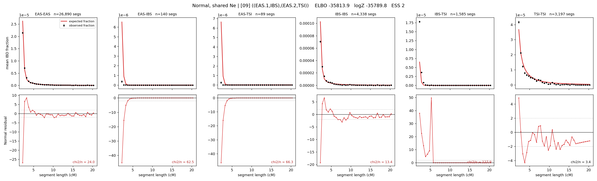

# `((EAS.1,IBS),(EAS.2,TSI))`

**Normal, shared Ne** | topology 09 of 21 | admixed leaf: **EAS** | 4 events, 8 nodes

## Model score

| quantity | value | |
|---|---|---|
| ELBO | -35813.93 | +- 0.38 (MC) |
| logZ (importance sampling) | -35789.85 | |
| ESS of the IS weights | 2.0 / 4000 | LOW -- treat logZ with suspicion |
| Stan dropped-constant correction | -24.10 | already applied |
| mode kept / MAP start / runtime | 2 / 11 | 19 s |
| mode search | 12/12 MAP starts succeeded | 3 distinct modes evaluated |

## Events (in temporal order, most recent first)

| # | type | detail | time (gen) | cumulative |
|---|---|---|---|---|
| 1 | ADMIXTURE | EAS -> EAS.1 + EAS.2 | 190.6 +- 0.5 | 190.6 |
| 2 | MERGE | EAS.1 + IBS -> n1 | 1.2 +- 0.1 | 191.7 |
| 3 | MERGE | EAS.2 + TSI -> n2 | 1.0 +- 0.0 | 192.7 |
| 4 | MERGE | n1 + n2 -> root | 1.0 +- 0.0 | 193.8 |

## Admixture fraction

**f = 0.000 +- 0.000** (fraction from `EAS.1`; 1.000 from `EAS.2`)

Collapsed to a tree: one source carries <5% of the ancestry, so this graph is behaving as its no-admixture special case.

## Effective sizes shared by IBD and SNP (haploid)

| node | Ne | sd of log Ne |
|---|---|---|
| `EAS` | 2,483,923 | 0.04 |
| `IBS` | 621,886 | 0.15 |
| `TSI` | 329,484 | 0.02 |
| `EAS.1` | 260 | 0.23 |
| `EAS.2` | 459 | 0.07 |
| `n1` | 81 | 0.03 |
| `n2` | 29,996 | 0.10 |
| `root` | 13,834 | 0.01 |

log-Ne random-walk step scale tau = 4.043

## Fit quality by component

| component | log-likelihood | n terms | chi2/n |
|---|---|---|---|
| IBD | -1,190.5 | 222 | 49.75 |
| SNP | -34,332.7 | 6 | 11458.77 |

IBD chi2/n uses Palamara model-derived Normal variance; SNP chi2/n uses its block SEs. Values near 1 indicate residuals on the modeled noise scale.

## SNP covariance residuals `(w_hat - W_pred)/w_se`

| | EAS | IBS | TSI |
|---|---|---|---|
| **EAS** | +110.30 | -96.56 | -121.54 |
| **IBS** | -96.56 | +48.30 | +145.34 |
| **TSI** | -121.54 | +145.34 | +95.02 |

