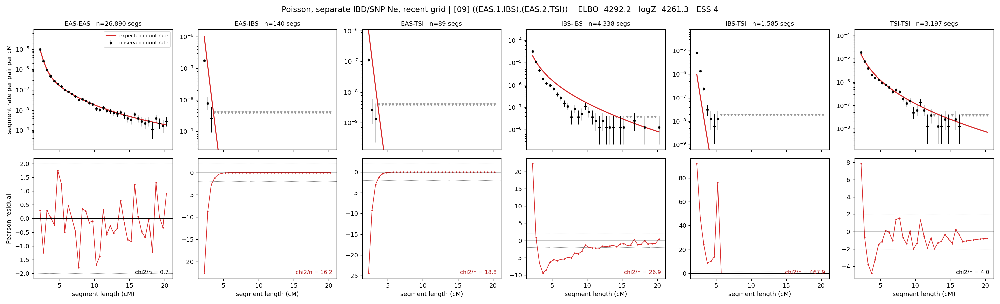

# `((EAS.1,IBS),(EAS.2,TSI))`

**Poisson, separate IBD/SNP Ne, recent grid** | topology 09 of 21 | admixed leaf: **EAS** | 4 events, 8 nodes

> Recent Ne grid: 0-5 and 5-10 generations. The first demographic event is explicitly constrained to occur after generation 10 (minimum 11 with the current one-generation gap).

## Model score

| quantity | value | |
|---|---|---|
| ELBO | -4292.22 | +- 0.42 (MC) |
| logZ (importance sampling) | -4261.28 | |
| ESS of the IS weights | 3.9 / 4000 | LOW -- treat logZ with suspicion |
| Stan dropped-constant correction | -40.81 | already applied |
| seed kept / runtime | 13 | 23 s |

## Events (in temporal order, most recent first)

| # | type | detail | time (gen) | cumulative |
|---|---|---|---|---|
| 1 | ADMIXTURE | EAS -> EAS.1 + EAS.2 | 131.2 +- 2.0 | 131.2 |
| 2 | MERGE | EAS.1 + IBS -> n1 | 55.9 +- 0.4 | 187.0 |
| 3 | MERGE | EAS.2 + TSI -> n2 | 1.0 +- 0.0 | 188.0 |
| 4 | MERGE | n1 + n2 -> root | 1.0 +- 0.0 | 189.0 |

## Admixture fraction

**f = 0.080 +- 0.003** (fraction from `EAS.1`; 0.920 from `EAS.2`)

## Recent effective sizes for IBD (haploid)

| population | 0-5 gen | 5-10 gen |
|---|---:|---:|
| `EAS` | 3,721,150 | 3,452,026 |
| `IBS` | 4,153,478 | 2,344,999 |
| `TSI` | 2,368,250 | 1,585,950 |

## Effective sizes for IBD (haploid)

| node | Ne | sd of log Ne |
|---|---|---|
| `EAS` | 2,467,401 | 0.02 |
| `IBS` | 224,346 | 0.01 |
| `TSI` | 306,145 | 0.04 |
| `EAS.1` | 235 | 0.02 |
| `EAS.2` | 1,049,174 | 0.02 |
| `n1` | 41,260 | 0.01 |
| `n2` | 99,796 | 0.02 |
| `root` | 49,964 | 0.02 |

log-Ne random-walk step scale tau_ibd = 2.249

## Recent effective sizes for SNP (haploid)

| population | 0-5 gen | 5-10 gen |
|---|---:|---:|
| `EAS` | 1,279 | 1,176 |
| `IBS` | 276,677 | 241,502 |
| `TSI` | 148,683 | 142,035 |

## Effective sizes for SNP (haploid)

| node | Ne | sd of log Ne |
|---|---|---|
| `EAS` | 905 | 0.03 |
| `IBS` | 185,470 | 0.07 |
| `TSI` | 121,255 | 0.04 |
| `EAS.1` | 3,331 | 0.02 |
| `EAS.2` | 1,263 | 0.02 |
| `n1` | 7,617 | 0.01 |
| `n2` | 10,160 | 0.01 |
| `root` | 9,204 | 0.01 |

log-Ne random-walk step scale tau_snp = 0.882

## Fit quality by component

| component | log-likelihood | n terms | chi2/n |
|---|---|---|---|
| IBD | -4,019.1 | 222 | 90.36 |
| SNP | +27.5 | 6 | 5.39 |

IBD chi2/n uses Poisson counting variance; SNP chi2/n uses its block SEs. Values near 1 indicate residuals on the modeled noise scale.

## SNP covariance residuals `(w_hat - W_pred)/w_se`

| | EAS | IBS | TSI |
|---|---|---|---|
| **EAS** | +0.02 | -0.07 | +0.03 |
| **IBS** | -0.07 | -0.14 | +0.29 |
| **TSI** | +0.03 | +0.29 | -0.34 |

