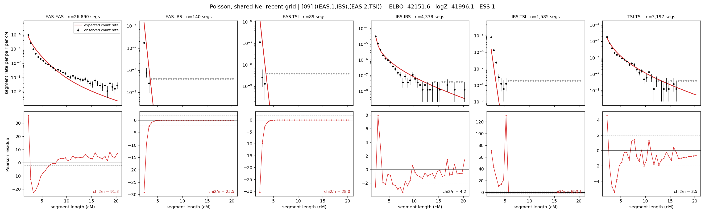

# `((EAS.1,IBS),(EAS.2,TSI))`

**Poisson, shared Ne, recent grid** | topology 09 of 21 | admixed leaf: **EAS** | 4 events, 8 nodes

> Recent Ne grid: 0-5 and 5-10 generations. The first demographic event is explicitly constrained to occur after generation 10 (minimum 11 with the current one-generation gap).

## Model score

| quantity | value | |
|---|---|---|
| ELBO | -42151.56 | +- 6.86 (MC) |
| logZ (importance sampling) | -41996.08 | |
| ESS of the IS weights | 1.0 / 4000 | LOW -- treat logZ with suspicion |
| Stan dropped-constant correction | -29.61 | already applied |
| seed kept / runtime | 13 | 19 s |

## Events (in temporal order, most recent first)

| # | type | detail | time (gen) | cumulative |
|---|---|---|---|---|
| 1 | ADMIXTURE | EAS -> EAS.1 + EAS.2 | 30.9 +- 0.4 | 30.9 |
| 2 | MERGE | EAS.1 + IBS -> n1 | 180.8 +- 0.4 | 211.7 |
| 3 | MERGE | EAS.2 + TSI -> n2 | 1.0 +- 0.0 | 212.7 |
| 4 | MERGE | n1 + n2 -> root | 1.0 +- 0.0 | 213.7 |

## Admixture fraction

**f = 0.000 +- 0.000** (fraction from `EAS.1`; 1.000 from `EAS.2`)

Collapsed to a tree: one source carries <5% of the ancestry, so this graph is behaving as its no-admixture special case.

## Recent effective sizes shared by IBD and SNP (haploid)

| population | 0-5 gen | 5-10 gen |
|---|---:|---:|
| `EAS` | 30,226,780,144 | 6,134,846,733 |
| `IBS` | 105,927,755,558 | 7,985,285,033 |
| `TSI` | 13,324,742 | 5,686,993 |

## Effective sizes shared by IBD and SNP (haploid)

| node | Ne | sd of log Ne |
|---|---|---|
| `EAS` | 15,474,953 | 0.95 |
| `IBS` | 410,777 | 0.04 |
| `TSI` | 291,245 | 0.08 |
| `EAS.1` | 2 | 0.12 |
| `EAS.2` | 634,243 | 0.02 |
| `n1` | 69 | 0.03 |
| `n2` | 3,043,767 | 0.05 |
| `root` | 14,559 | 0.01 |

log-Ne random-walk step scale tau = 3.742

## Fit quality by component

| component | log-likelihood | n terms | chi2/n |
|---|---|---|---|
| IBD | -5,495.4 | 222 | 144.50 |
| SNP | -36,053.0 | 6 | 12032.22 |

IBD chi2/n uses Poisson counting variance; SNP chi2/n uses its block SEs. Values near 1 indicate residuals on the modeled noise scale.

## SNP covariance residuals `(w_hat - W_pred)/w_se`

| | EAS | IBS | TSI |
|---|---|---|---|
| **EAS** | +112.60 | -97.09 | -125.57 |
| **IBS** | -97.09 | +41.87 | +153.30 |
| **TSI** | -125.57 | +153.30 | +95.20 |

