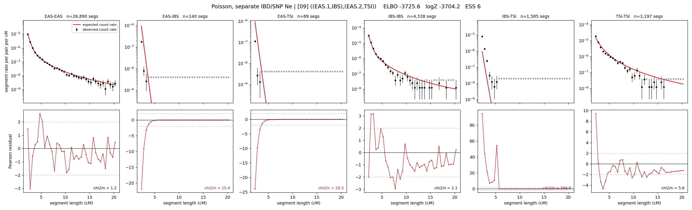

# `((EAS.1,IBS),(EAS.2,TSI))`

**Poisson, separate IBD/SNP Ne** | topology 09 of 21 | admixed leaf: **EAS** | 4 events, 8 nodes

## Model score

| quantity | value | |
|---|---|---|
| ELBO | -3725.65 | +- 0.31 (MC) |
| logZ (importance sampling) | -3704.19 | |
| ESS of the IS weights | 5.8 / 4000 | LOW -- treat logZ with suspicion |
| Stan dropped-constant correction | -29.78 | already applied |
| mode kept / MAP start / runtime | 2 / 2 | 19 s |
| mode search | 12/12 MAP starts succeeded | 3 distinct modes evaluated |

## Events (in temporal order, most recent first)

| # | type | detail | time (gen) | cumulative |
|---|---|---|---|---|
| 1 | ADMIXTURE | EAS -> EAS.1 + EAS.2 | 124.3 +- 0.4 | 124.3 |
| 2 | MERGE | EAS.1 + IBS -> n1 | 2.3 +- 0.0 | 126.6 |
| 3 | MERGE | EAS.2 + TSI -> n2 | 49.5 +- 0.4 | 176.0 |
| 4 | MERGE | n1 + n2 -> root | 1.1 +- 0.0 | 177.1 |

## Admixture fraction

**f = 0.000 +- 0.000** (fraction from `EAS.1`; 1.000 from `EAS.2`)

Collapsed to a tree: one source carries <5% of the ancestry, so this graph is behaving as its no-admixture special case.

## Effective sizes for IBD (haploid)

| node | Ne | sd of log Ne |
|---|---|---|
| `EAS` | 2,665,887 | 0.02 |
| `IBS` | 609,537 | 0.03 |
| `TSI` | 320,291 | 0.05 |
| `EAS.1` | 10,792 | 0.08 |
| `EAS.2` | 45,331 | 0.02 |
| `n1` | 11,833 | 0.08 |
| `n2` | 114,318 | 0.03 |
| `root` | 78,132 | 0.03 |

log-Ne random-walk step scale tau_ibd = 1.482

## Effective sizes for SNP (haploid)

| node | Ne | sd of log Ne |
|---|---|---|
| `EAS` | 727 | 0.01 |
| `IBS` | 242,609 | 0.04 |
| `TSI` | 112,824 | 0.05 |
| `EAS.1` | 64,469 | 0.03 |
| `EAS.2` | 5,593 | 0.02 |
| `n1` | 65,432 | 0.03 |
| `n2` | 21,552 | 0.01 |
| `root` | 22,103 | 0.01 |

log-Ne random-walk step scale tau_snp = 1.042

## Fit quality by component

| component | log-likelihood | n terms | chi2/n |
|---|---|---|---|
| IBD | -3,566.4 | 222 | 73.20 |
| SNP | +37.4 | 6 | 2.06 |

IBD chi2/n uses Poisson counting variance; SNP chi2/n uses its block SEs. Values near 1 indicate residuals on the modeled noise scale.

## SNP covariance residuals `(w_hat - W_pred)/w_se`

| | EAS | IBS | TSI |
|---|---|---|---|
| **EAS** | +0.04 | -0.08 | +0.00 |
| **IBS** | -0.08 | -0.15 | +0.33 |
| **TSI** | +0.00 | +0.33 | -0.31 |

