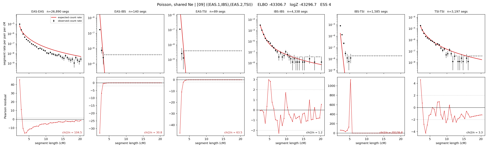

# `((EAS.1,IBS),(EAS.2,TSI))`

**Poisson, shared Ne** | topology 09 of 21 | admixed leaf: **EAS** | 4 events, 8 nodes

## Model score

| quantity | value | |
|---|---|---|
| ELBO | -43306.75 | +- 0.11 (MC) |
| logZ (importance sampling) | -43296.65 | |
| ESS of the IS weights | 3.6 / 4000 | LOW -- treat logZ with suspicion |
| Stan dropped-constant correction | -24.10 | already applied |
| seed kept / runtime | 1 | 16 s |

## Events (in temporal order, most recent first)

| # | type | detail | time (gen) | cumulative |
|---|---|---|---|---|
| 1 | ADMIXTURE | EAS -> EAS.1 + EAS.2 | 1.0 +- 0.0 | 1.0 |
| 2 | MERGE | EAS.1 + IBS -> n1 | 80.8 +- 0.5 | 81.8 |
| 3 | MERGE | EAS.2 + TSI -> n2 | 200.6 +- 0.3 | 282.4 |
| 4 | MERGE | n1 + n2 -> root | 7.1 +- 0.1 | 289.5 |

## Admixture fraction

**f = 0.000 +- 0.000** (fraction from `EAS.1`; 1.000 from `EAS.2`)

Collapsed to a tree: one source carries <5% of the ancestry, so this graph is behaving as its no-admixture special case.

## Effective sizes shared by IBD and SNP (haploid)

| node | Ne | sd of log Ne |
|---|---|---|
| `EAS` | 1,135,146 | 0.10 |
| `IBS` | 854,185 | 0.11 |
| `TSI` | 330,523 | 0.02 |
| `EAS.1` | 37,219 | 0.34 |
| `EAS.2` | 1,183,794 | 0.03 |
| `n1` | 50,579 | 0.03 |
| `n2` | 285 | 0.02 |
| `root` | 769 | 0.01 |

log-Ne random-walk step scale tau = 1.616

## Fit quality by component

| component | log-likelihood | n terms | chi2/n |
|---|---|---|---|
| IBD | -7,057.6 | 222 | 5905.83 |
| SNP | -36,053.0 | 6 | 12032.22 |

IBD chi2/n uses Poisson counting variance; SNP chi2/n uses its block SEs. Values near 1 indicate residuals on the modeled noise scale.

## SNP covariance residuals `(w_hat - W_pred)/w_se`

| | EAS | IBS | TSI |
|---|---|---|---|
| **EAS** | +112.64 | -97.30 | -125.43 |
| **IBS** | -97.30 | +42.32 | +153.26 |
| **TSI** | -125.43 | +153.26 | +94.99 |

