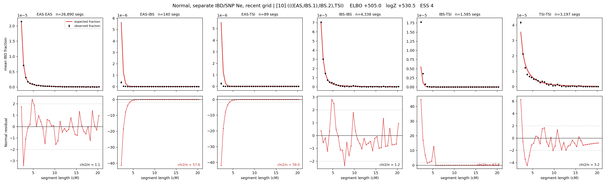

# `(((EAS,IBS.1),IBS.2),TSI)`

**Normal, separate IBD/SNP Ne, recent grid** | topology 10 of 21 | admixed leaf: **IBS** | 4 events, 8 nodes

> Recent Ne grid: 0-5 and 5-10 generations. The first demographic event is explicitly constrained to occur after generation 10 (minimum 11 with the current one-generation gap).

## Model score

| quantity | value | |
|---|---|---|
| ELBO | +504.99 | +- 0.30 (MC) |
| logZ (importance sampling) | +530.47 | |
| ESS of the IS weights | 3.5 / 4000 | LOW -- treat logZ with suspicion |
| Stan dropped-constant correction | -40.81 | already applied |
| seed kept / runtime | 7 | 23 s |

## Events (in temporal order, most recent first)

| # | type | detail | time (gen) | cumulative |
|---|---|---|---|---|
| 1 | ADMIXTURE | IBS -> IBS.1 + IBS.2 | 92.2 +- 0.3 | 92.2 |
| 2 | MERGE | IBS.2 + EAS -> n1 | 39.7 +- 0.3 | 132.0 |
| 3 | MERGE | IBS.1 + n1 -> n2 | 12.5 +- 0.1 | 144.4 |
| 4 | MERGE | n2 + TSI -> root | 1.0 +- 0.0 | 145.5 |

## Admixture fraction

**f = 1.000 +- 0.000** (fraction from `IBS.1`; 0.000 from `IBS.2`)

Collapsed to a tree: one source carries <5% of the ancestry, so this graph is behaving as its no-admixture special case.

## Recent effective sizes for IBD (haploid)

| population | 0-5 gen | 5-10 gen |
|---|---:|---:|
| `EAS` | 4,019,868 | 3,368,185 |
| `IBS` | 1,575,874 | 1,340,675 |
| `TSI` | 1,727,055 | 1,211,321 |

## Effective sizes for IBD (haploid)

| node | Ne | sd of log Ne |
|---|---|---|
| `EAS` | 2,582,987 | 0.03 |
| `IBS` | 742,632 | 0.08 |
| `TSI` | 317,488 | 0.05 |
| `IBS.1` | 32,927 | 0.04 |
| `IBS.2` | 21,788 | 0.07 |
| `n1` | 18,937 | 0.02 |
| `n2` | 158,360 | 0.01 |
| `root` | 81,738 | 0.01 |

log-Ne random-walk step scale tau_ibd = 1.933

## Recent effective sizes for SNP (haploid)

| population | 0-5 gen | 5-10 gen |
|---|---:|---:|
| `EAS` | 734 | 727 |
| `IBS` | 114,537 | 115,106 |
| `TSI` | 107,238 | 107,351 |

## Effective sizes for SNP (haploid)

| node | Ne | sd of log Ne |
|---|---|---|
| `EAS` | 740 | 0.01 |
| `IBS` | 117,108 | 0.04 |
| `TSI` | 108,880 | 0.04 |
| `IBS.1` | 72,744 | 0.03 |
| `IBS.2` | 8,636 | 0.03 |
| `n1` | 7,074 | 0.01 |
| `n2` | 14,766 | 0.00 |
| `root` | 15,299 | 0.00 |

log-Ne random-walk step scale tau_snp = 1.078

## Fit quality by component

| component | log-likelihood | n terms | chi2/n |
|---|---|---|---|
| IBD | +742.7 | 222 | 31.77 |
| SNP | +38.6 | 6 | 1.66 |

IBD chi2/n uses Palamara model-derived Normal variance; SNP chi2/n uses its block SEs. Values near 1 indicate residuals on the modeled noise scale.

## SNP covariance residuals `(w_hat - W_pred)/w_se`

| | EAS | IBS | TSI |
|---|---|---|---|
| **EAS** | +0.05 | +0.06 | -0.16 |
| **IBS** | +0.06 | -0.44 | +0.35 |
| **TSI** | -0.16 | +0.35 | -0.02 |

