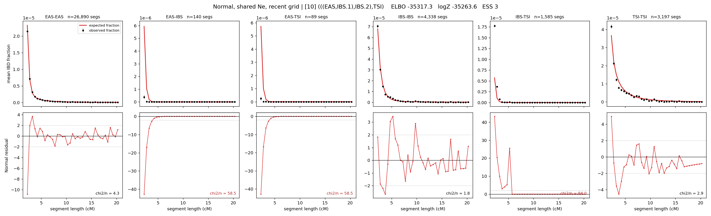

# `(((EAS,IBS.1),IBS.2),TSI)`

**Normal, shared Ne, recent grid** | topology 10 of 21 | admixed leaf: **IBS** | 4 events, 8 nodes

> Recent Ne grid: 0-5 and 5-10 generations. The first demographic event is explicitly constrained to occur after generation 10 (minimum 11 with the current one-generation gap).

## Model score

| quantity | value | |
|---|---|---|
| ELBO | -35317.33 | +- 0.72 (MC) |
| logZ (importance sampling) | -35263.61 | |
| ESS of the IS weights | 3.1 / 4000 | LOW -- treat logZ with suspicion |
| Stan dropped-constant correction | -29.61 | already applied |
| mode kept / MAP start / runtime | 1 / 1 | 123 s |
| mode search | 12/12 MAP starts succeeded | 3 distinct modes evaluated |

## Events (in temporal order, most recent first)

| # | type | detail | time (gen) | cumulative |
|---|---|---|---|---|
| 1 | ADMIXTURE | IBS -> IBS.1 + IBS.2 | 66.5 +- 0.5 | 66.5 |
| 2 | MERGE | IBS.2 + EAS -> n1 | 99.3 +- 0.4 | 165.8 |
| 3 | MERGE | IBS.1 + n1 -> n2 | 2.5 +- 0.1 | 168.3 |
| 4 | MERGE | n2 + TSI -> root | 1.0 +- 0.0 | 169.3 |

## Admixture fraction

**f = 0.999 +- 0.000** (fraction from `IBS.1`; 0.001 from `IBS.2`)

Collapsed to a tree: one source carries <5% of the ancestry, so this graph is behaving as its no-admixture special case.

## Recent effective sizes shared by IBD and SNP (haploid)

| population | 0-5 gen | 5-10 gen |
|---|---:|---:|
| `EAS` | 4,532,746 | 4,285,603 |
| `IBS` | 2,489,132 | 1,127,436 |
| `TSI` | 1,115,534 | 1,310,865 |

## Effective sizes shared by IBD and SNP (haploid)

| node | Ne | sd of log Ne |
|---|---|---|
| `EAS` | 2,382,044 | 0.09 |
| `IBS` | 1,237,276 | 0.19 |
| `TSI` | 314,263 | 0.03 |
| `IBS.1` | 71,764 | 0.05 |
| `IBS.2` | 0 | 0.42 |
| `n1` | 1,380 | 0.05 |
| `n2` | 34,777 | 0.15 |
| `root` | 36,172 | 0.01 |

log-Ne random-walk step scale tau = 1.915

## Fit quality by component

| component | log-likelihood | n terms | chi2/n |
|---|---|---|---|
| IBD | +403.2 | 222 | 35.27 |
| SNP | -35,456.2 | 6 | 11833.28 |

IBD chi2/n uses Palamara model-derived Normal variance; SNP chi2/n uses its block SEs. Values near 1 indicate residuals on the modeled noise scale.

## SNP covariance residuals `(w_hat - W_pred)/w_se`

| | EAS | IBS | TSI |
|---|---|---|---|
| **EAS** | +111.64 | -96.17 | -124.59 |
| **IBS** | -96.17 | +41.51 | +151.81 |
| **TSI** | -124.59 | +151.81 | +94.75 |

