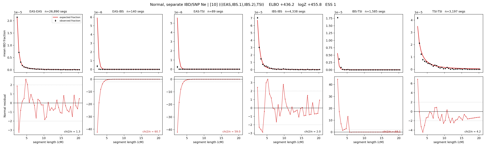

# `(((EAS,IBS.1),IBS.2),TSI)`

**Normal, separate IBD/SNP Ne** | topology 10 of 21 | admixed leaf: **IBS** | 4 events, 8 nodes

## Model score

| quantity | value | |
|---|---|---|
| ELBO | +436.18 | +- 0.27 (MC) |
| logZ (importance sampling) | +455.76 | |
| ESS of the IS weights | 1.1 / 4000 | LOW -- treat logZ with suspicion |
| Stan dropped-constant correction | -29.78 | already applied |
| seed kept / runtime | 7 | 17 s |

## Events (in temporal order, most recent first)

| # | type | detail | time (gen) | cumulative |
|---|---|---|---|---|
| 1 | ADMIXTURE | IBS -> IBS.1 + IBS.2 | 67.3 +- 0.2 | 67.3 |
| 2 | MERGE | IBS.2 + EAS -> n1 | 61.6 +- 0.7 | 128.9 |
| 3 | MERGE | IBS.1 + n1 -> n2 | 16.7 +- 0.1 | 145.6 |
| 4 | MERGE | n2 + TSI -> root | 1.3 +- 0.0 | 146.8 |

## Admixture fraction

**f = 0.996 +- 0.000** (fraction from `IBS.1`; 0.004 from `IBS.2`)

Collapsed to a tree: one source carries <5% of the ancestry, so this graph is behaving as its no-admixture special case.

## Effective sizes for IBD (haploid)

| node | Ne | sd of log Ne |
|---|---|---|
| `EAS` | 2,667,891 | 0.02 |
| `IBS` | 1,187,486 | 0.02 |
| `TSI` | 326,890 | 0.03 |
| `IBS.1` | 66,541 | 0.01 |
| `IBS.2` | 73,893 | 0.01 |
| `n1` | 26,442 | 0.01 |
| `n2` | 58,656 | 0.01 |
| `root` | 77,945 | 0.01 |

log-Ne random-walk step scale tau_ibd = 1.345

## Effective sizes for SNP (haploid)

| node | Ne | sd of log Ne |
|---|---|---|
| `EAS` | 709 | 0.01 |
| `IBS` | 25,597,030 | 0.04 |
| `TSI` | 32,225,105 | 0.04 |
| `IBS.1` | 2,055,232 | 0.02 |
| `IBS.2` | 3,096,632 | 0.06 |
| `n1` | 349,885 | 0.01 |
| `n2` | 253,470 | 0.01 |
| `root` | 224,945 | 0.01 |

log-Ne random-walk step scale tau_snp = 1.864

## Fit quality by component

| component | log-likelihood | n terms | chi2/n |
|---|---|---|---|
| IBD | +644.4 | 222 | 32.62 |
| SNP | +17.3 | 6 | 8.76 |

IBD chi2/n uses Palamara model-derived Normal variance; SNP chi2/n uses its block SEs. Values near 1 indicate residuals on the modeled noise scale.

## SNP covariance residuals `(w_hat - W_pred)/w_se`

| | EAS | IBS | TSI |
|---|---|---|---|
| **EAS** | -0.53 | +0.60 | +0.45 |
| **IBS** | +0.60 | +3.01 | -4.45 |
| **TSI** | +0.45 | -4.45 | +3.33 |

