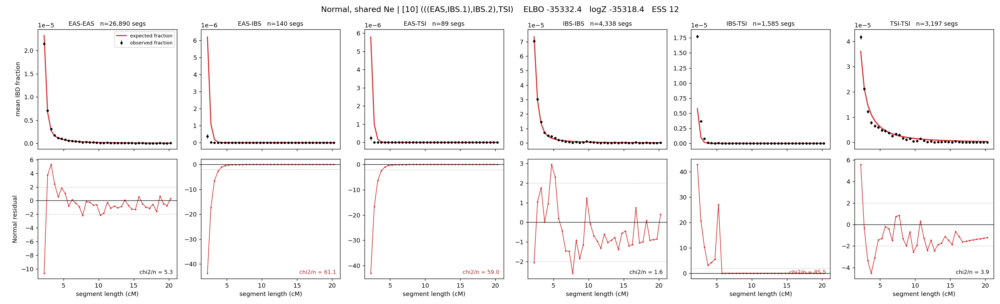

# `(((EAS,IBS.1),IBS.2),TSI)`

**Normal, shared Ne** | topology 10 of 21 | admixed leaf: **IBS** | 4 events, 8 nodes

## Model score

| quantity | value | |
|---|---|---|
| ELBO | -35332.41 | +- 0.20 (MC) |
| logZ (importance sampling) | -35318.42 | |
| ESS of the IS weights | 12.2 / 4000 | LOW -- treat logZ with suspicion |
| Stan dropped-constant correction | -24.10 | already applied |
| mode kept / MAP start / runtime | 1 / 2 | 18 s |
| mode search | 12/12 MAP starts succeeded | 3 distinct modes evaluated |

## Events (in temporal order, most recent first)

| # | type | detail | time (gen) | cumulative |
|---|---|---|---|---|
| 1 | ADMIXTURE | IBS -> IBS.1 + IBS.2 | 109.2 +- 0.6 | 109.2 |
| 2 | MERGE | IBS.2 + EAS -> n1 | 59.1 +- 0.4 | 168.3 |
| 3 | MERGE | IBS.1 + n1 -> n2 | 2.1 +- 0.0 | 170.4 |
| 4 | MERGE | n2 + TSI -> root | 1.0 +- 0.0 | 171.4 |

## Admixture fraction

**f = 0.982 +- 0.000** (fraction from `IBS.1`; 0.018 from `IBS.2`)

Collapsed to a tree: one source carries <5% of the ancestry, so this graph is behaving as its no-admixture special case.

## Effective sizes shared by IBD and SNP (haploid)

| node | Ne | sd of log Ne |
|---|---|---|
| `EAS` | 2,493,988 | 0.04 |
| `IBS` | 721,118 | 0.04 |
| `TSI` | 324,125 | 0.02 |
| `IBS.1` | 26,449 | 0.01 |
| `IBS.2` | 1 | 0.03 |
| `n1` | 1,091 | 0.02 |
| `n2` | 37,409 | 0.01 |
| `root` | 33,353 | 0.01 |

log-Ne random-walk step scale tau = 2.084

## Fit quality by component

| component | log-likelihood | n terms | chi2/n |
|---|---|---|---|
| IBD | +292.2 | 222 | 36.13 |
| SNP | -35,401.0 | 6 | 11814.86 |

IBD chi2/n uses Palamara model-derived Normal variance; SNP chi2/n uses its block SEs. Values near 1 indicate residuals on the modeled noise scale.

## SNP covariance residuals `(w_hat - W_pred)/w_se`

| | EAS | IBS | TSI |
|---|---|---|---|
| **EAS** | +111.59 | -96.25 | -124.42 |
| **IBS** | -96.25 | +41.95 | +151.51 |
| **TSI** | -124.42 | +151.51 | +94.71 |

