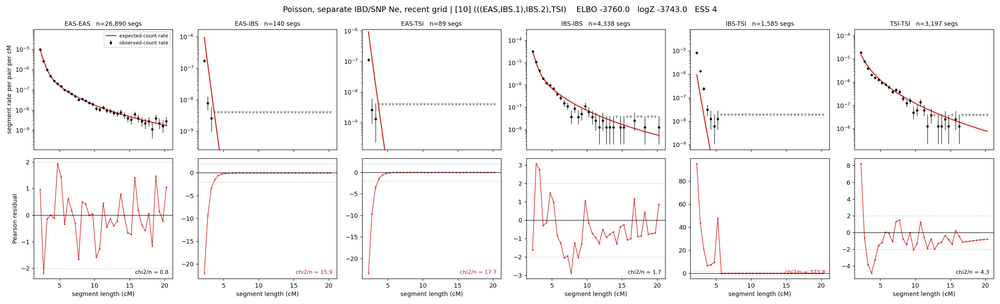

# `(((EAS,IBS.1),IBS.2),TSI)`

**Poisson, separate IBD/SNP Ne, recent grid** | topology 10 of 21 | admixed leaf: **IBS** | 4 events, 8 nodes

> Recent Ne grid: 0-5 and 5-10 generations. The first demographic event is explicitly constrained to occur after generation 10 (minimum 11 with the current one-generation gap).

## Model score

| quantity | value | |
|---|---|---|
| ELBO | -3759.97 | +- 0.17 (MC) |
| logZ (importance sampling) | -3742.96 | |
| ESS of the IS weights | 4.5 / 4000 | LOW -- treat logZ with suspicion |
| Stan dropped-constant correction | -40.81 | already applied |
| seed kept / runtime | 7 | 22 s |

## Events (in temporal order, most recent first)

| # | type | detail | time (gen) | cumulative |
|---|---|---|---|---|
| 1 | ADMIXTURE | IBS -> IBS.1 + IBS.2 | 131.8 +- 0.2 | 131.8 |
| 2 | MERGE | IBS.2 + EAS -> n1 | 1.0 +- 0.0 | 132.8 |
| 3 | MERGE | IBS.1 + n1 -> n2 | 38.5 +- 0.1 | 171.4 |
| 4 | MERGE | n2 + TSI -> root | 1.0 +- 0.0 | 172.4 |

## Admixture fraction

**f = 1.000 +- 0.000** (fraction from `IBS.1`; 0.000 from `IBS.2`)

Collapsed to a tree: one source carries <5% of the ancestry, so this graph is behaving as its no-admixture special case.

## Recent effective sizes for IBD (haploid)

| population | 0-5 gen | 5-10 gen |
|---|---:|---:|
| `EAS` | 4,101,625 | 3,721,210 |
| `IBS` | 1,783,574 | 1,468,658 |
| `TSI` | 1,832,519 | 1,299,553 |

## Effective sizes for IBD (haploid)

| node | Ne | sd of log Ne |
|---|---|---|
| `EAS` | 2,480,882 | 0.01 |
| `IBS` | 550,906 | 0.05 |
| `TSI` | 305,298 | 0.03 |
| `IBS.1` | 9,338 | 0.02 |
| `IBS.2` | 31,006 | 0.01 |
| `n1` | 31,004 | 0.01 |
| `n2` | 143,444 | 0.01 |
| `root` | 92,137 | 0.01 |

log-Ne random-walk step scale tau_ibd = 1.886

## Recent effective sizes for SNP (haploid)

| population | 0-5 gen | 5-10 gen |
|---|---:|---:|
| `EAS` | 915 | 889 |
| `IBS` | 204,949 | 199,122 |
| `TSI` | 162,966 | 158,535 |

## Effective sizes for SNP (haploid)

| node | Ne | sd of log Ne |
|---|---|---|
| `EAS` | 786 | 0.01 |
| `IBS` | 174,089 | 0.04 |
| `TSI` | 142,357 | 0.03 |
| `IBS.1` | 46,778 | 0.02 |
| `IBS.2` | 2,974 | 0.01 |
| `n1` | 2,974 | 0.01 |
| `n2` | 17,600 | 0.00 |
| `root` | 17,267 | 0.00 |

log-Ne random-walk step scale tau_snp = 1.204

## Fit quality by component

| component | log-likelihood | n terms | chi2/n |
|---|---|---|---|
| IBD | -3,498.4 | 222 | 69.12 |
| SNP | +38.1 | 6 | 1.84 |

IBD chi2/n uses Poisson counting variance; SNP chi2/n uses its block SEs. Values near 1 indicate residuals on the modeled noise scale.

## SNP covariance residuals `(w_hat - W_pred)/w_se`

| | EAS | IBS | TSI |
|---|---|---|---|
| **EAS** | +0.01 | +0.21 | -0.24 |
| **IBS** | +0.21 | -0.60 | +0.22 |
| **TSI** | -0.24 | +0.22 | +0.24 |

