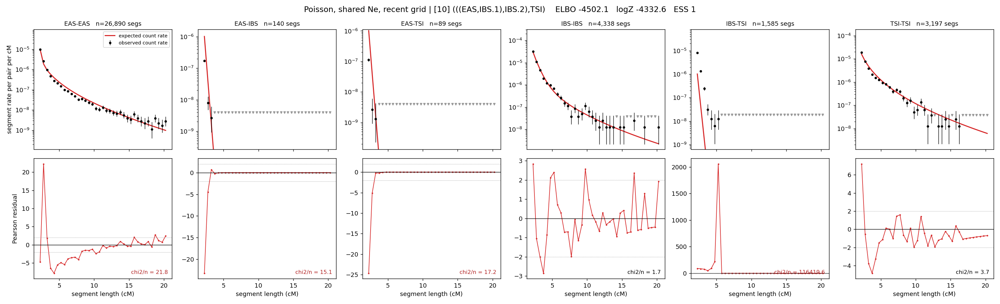

# `(((EAS,IBS.1),IBS.2),TSI)`

**Poisson, shared Ne, recent grid** | topology 10 of 21 | admixed leaf: **IBS** | 4 events, 8 nodes

> Recent Ne grid: 0-5 and 5-10 generations. The first demographic event is explicitly constrained to occur after generation 10 (minimum 11 with the current one-generation gap).

## Model score

| quantity | value | |
|---|---|---|
| ELBO | -4502.12 | +- 3.28 (MC) |
| logZ (importance sampling) | -4332.57 | |
| ESS of the IS weights | 1.1 / 4000 | LOW -- treat logZ with suspicion |
| Stan dropped-constant correction | -29.61 | already applied |
| mode kept / MAP start / runtime | 1 / 8 | 25 s |
| mode search | 12/12 MAP starts succeeded | 3 distinct modes evaluated |

## Events (in temporal order, most recent first)

| # | type | detail | time (gen) | cumulative |
|---|---|---|---|---|
| 1 | ADMIXTURE | IBS -> IBS.1 + IBS.2 | 71.4 +- 1.1 | 71.4 |
| 2 | MERGE | IBS.2 + EAS -> n1 | 222.9 +- 1.3 | 294.3 |
| 3 | MERGE | IBS.1 + n1 -> n2 | 5.2 +- 0.2 | 299.4 |
| 4 | MERGE | n2 + TSI -> root | 1.0 +- 0.0 | 300.4 |

## Admixture fraction

**f = 1.000 +- 0.000** (fraction from `IBS.1`; 0.000 from `IBS.2`)

Collapsed to a tree: one source carries <5% of the ancestry, so this graph is behaving as its no-admixture special case.

## Recent effective sizes shared by IBD and SNP (haploid)

| population | 0-5 gen | 5-10 gen |
|---|---:|---:|
| `EAS` | 64,858,426 | 46,408,407 |
| `IBS` | 13,492,611 | 7,780,266 |
| `TSI` | 4,500,968 | 2,507,934 |

## Effective sizes shared by IBD and SNP (haploid)

| node | Ne | sd of log Ne |
|---|---|---|
| `EAS` | 1,593,191 | 0.11 |
| `IBS` | 810,461 | 0.11 |
| `TSI` | 306,892 | 0.10 |
| `IBS.1` | 67,660 | 0.09 |
| `IBS.2` | 1,894 | 0.35 |
| `n1` | 29 | 0.06 |
| `n2` | 2,840 | 0.07 |
| `root` | 904 | 0.02 |

log-Ne random-walk step scale tau = 2.619

## Fit quality by component

| component | log-likelihood | n terms | chi2/n |
|---|---|---|---|
| IBD | -4,188.4 | 222 | 19805.48 |
| SNP | -31.6 | 6 | 25.08 |

IBD chi2/n uses Poisson counting variance; SNP chi2/n uses its block SEs. Values near 1 indicate residuals on the modeled noise scale.

## SNP covariance residuals `(w_hat - W_pred)/w_se`

| | EAS | IBS | TSI |
|---|---|---|---|
| **EAS** | +0.42 | +0.68 | -1.51 |
| **IBS** | +0.68 | -4.53 | +3.47 |
| **TSI** | -1.51 | +3.47 | -0.38 |

