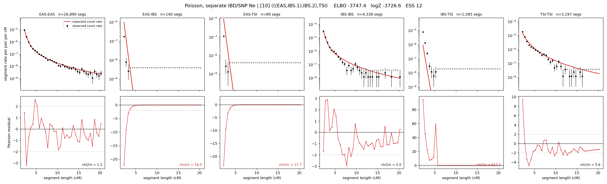

# `(((EAS,IBS.1),IBS.2),TSI)`

**Poisson, separate IBD/SNP Ne** | topology 10 of 21 | admixed leaf: **IBS** | 4 events, 8 nodes

## Model score

| quantity | value | |
|---|---|---|
| ELBO | -3747.38 | +- 0.31 (MC) |
| logZ (importance sampling) | -3726.59 | |
| ESS of the IS weights | 12.1 / 4000 | LOW -- treat logZ with suspicion |
| Stan dropped-constant correction | -29.78 | already applied |
| seed kept / runtime | 1 | 16 s |

## Events (in temporal order, most recent first)

| # | type | detail | time (gen) | cumulative |
|---|---|---|---|---|
| 1 | ADMIXTURE | IBS -> IBS.1 + IBS.2 | 121.7 +- 2.5 | 121.7 |
| 2 | MERGE | IBS.2 + EAS -> n1 | 1.0 +- 0.0 | 122.7 |
| 3 | MERGE | IBS.1 + n1 -> n2 | 56.0 +- 4.0 | 178.7 |
| 4 | MERGE | n2 + TSI -> root | 1.0 +- 0.0 | 179.7 |

## Admixture fraction

**f = 1.000 +- 0.000** (fraction from `IBS.1`; 0.000 from `IBS.2`)

Collapsed to a tree: one source carries <5% of the ancestry, so this graph is behaving as its no-admixture special case.

## Effective sizes for IBD (haploid)

| node | Ne | sd of log Ne |
|---|---|---|
| `EAS` | 2,676,641 | 0.06 |
| `IBS` | 620,902 | 0.03 |
| `TSI` | 320,464 | 0.05 |
| `IBS.1` | 14,303 | 0.10 |
| `IBS.2` | 49,159 | 0.10 |
| `n1` | 49,156 | 0.10 |
| `n2` | 81,790 | 0.07 |
| `root` | 71,481 | 0.06 |

log-Ne random-walk step scale tau_ibd = 1.032

## Effective sizes for SNP (haploid)

| node | Ne | sd of log Ne |
|---|---|---|
| `EAS` | 826 | 0.02 |
| `IBS` | 219,591 | 0.18 |
| `TSI` | 173,507 | 0.45 |
| `IBS.1` | 70,068 | 0.04 |
| `IBS.2` | 1,781 | 0.08 |
| `n1` | 1,780 | 0.08 |
| `n2` | 24,217 | 0.10 |
| `root` | 24,693 | 0.11 |

log-Ne random-walk step scale tau_snp = 0.953

## Fit quality by component

| component | log-likelihood | n terms | chi2/n |
|---|---|---|---|
| IBD | -3,564.2 | 222 | 75.92 |
| SNP | +35.6 | 6 | 2.69 |

IBD chi2/n uses Poisson counting variance; SNP chi2/n uses its block SEs. Values near 1 indicate residuals on the modeled noise scale.

## SNP covariance residuals `(w_hat - W_pred)/w_se`

| | EAS | IBS | TSI |
|---|---|---|---|
| **EAS** | -0.02 | +0.12 | -0.07 |
| **IBS** | +0.12 | -0.19 | -0.03 |
| **TSI** | -0.07 | -0.03 | +0.17 |

