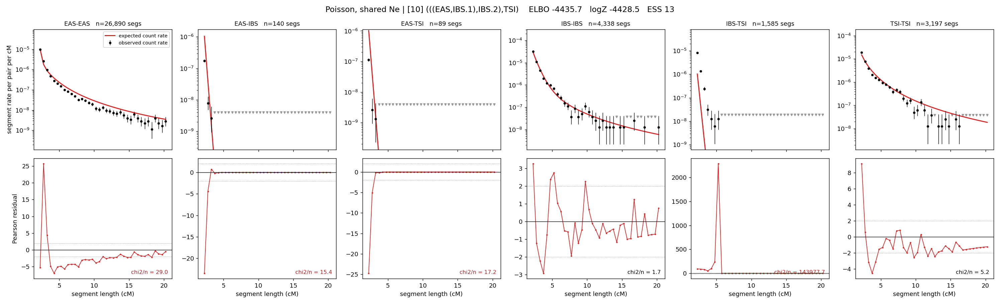

# `(((EAS,IBS.1),IBS.2),TSI)`

**Poisson, shared Ne** | topology 10 of 21 | admixed leaf: **IBS** | 4 events, 8 nodes

## Model score

| quantity | value | |
|---|---|---|
| ELBO | -4435.71 | +- 0.09 (MC) |
| logZ (importance sampling) | -4428.53 | |
| ESS of the IS weights | 13.5 / 4000 | LOW -- treat logZ with suspicion |
| Stan dropped-constant correction | -24.10 | already applied |
| mode kept / MAP start / runtime | 1 / 11 | 16 s |
| mode search | 10/12 MAP starts succeeded | 3 distinct modes evaluated |

## Events (in temporal order, most recent first)

| # | type | detail | time (gen) | cumulative |
|---|---|---|---|---|
| 1 | ADMIXTURE | IBS -> IBS.1 + IBS.2 | 67.0 +- 0.4 | 67.0 |
| 2 | MERGE | IBS.2 + EAS -> n1 | 222.2 +- 0.2 | 289.2 |
| 3 | MERGE | IBS.1 + n1 -> n2 | 13.7 +- 0.1 | 302.9 |
| 4 | MERGE | n2 + TSI -> root | 1.0 +- 0.0 | 304.0 |

## Admixture fraction

**f = 1.000 +- 0.000** (fraction from `IBS.1`; 0.000 from `IBS.2`)

Collapsed to a tree: one source carries <5% of the ancestry, so this graph is behaving as its no-admixture special case.

## Effective sizes shared by IBD and SNP (haploid)

| node | Ne | sd of log Ne |
|---|---|---|
| `EAS` | 1,724,671 | 0.02 |
| `IBS` | 1,009,576 | 0.03 |
| `TSI` | 323,532 | 0.03 |
| `IBS.1` | 73,042 | 0.03 |
| `IBS.2` | 75 | 0.01 |
| `n1` | 77 | 0.00 |
| `n2` | 1,310 | 0.01 |
| `root` | 788 | 0.01 |

log-Ne random-walk step scale tau = 1.770

## Fit quality by component

| component | log-likelihood | n terms | chi2/n |
|---|---|---|---|
| IBD | -4,282.2 | 222 | 24055.75 |
| SNP | +24.2 | 6 | 6.46 |

IBD chi2/n uses Poisson counting variance; SNP chi2/n uses its block SEs. Values near 1 indicate residuals on the modeled noise scale.

## SNP covariance residuals `(w_hat - W_pred)/w_se`

| | EAS | IBS | TSI |
|---|---|---|---|
| **EAS** | +0.71 | +0.09 | -1.50 |
| **IBS** | +0.09 | -4.01 | +4.11 |
| **TSI** | -1.50 | +4.11 | -1.01 |

