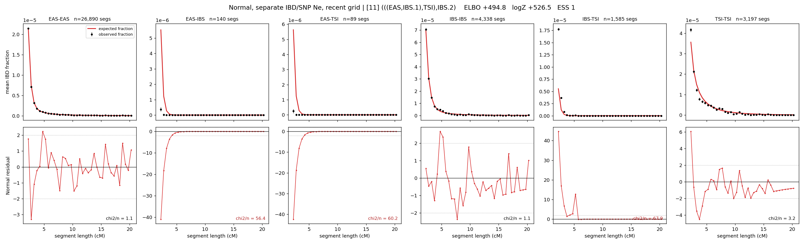

# `(((EAS,IBS.1),TSI),IBS.2)`

**Normal, separate IBD/SNP Ne, recent grid** | topology 11 of 21 | admixed leaf: **IBS** | 4 events, 8 nodes

> Recent Ne grid: 0-5 and 5-10 generations. The first demographic event is explicitly constrained to occur after generation 10 (minimum 11 with the current one-generation gap).

## Model score

| quantity | value | |
|---|---|---|
| ELBO | +494.78 | +- 0.44 (MC) |
| logZ (importance sampling) | +526.52 | |
| ESS of the IS weights | 1.1 / 4000 | LOW -- treat logZ with suspicion |
| Stan dropped-constant correction | -40.81 | already applied |
| mode kept / MAP start / runtime | 1 / 6 | 27 s |
| mode search | 12/12 MAP starts succeeded | 3 distinct modes evaluated |

## Events (in temporal order, most recent first)

| # | type | detail | time (gen) | cumulative |
|---|---|---|---|---|
| 1 | ADMIXTURE | IBS -> IBS.1 + IBS.2 | 92.6 +- 1.1 | 92.6 |
| 2 | MERGE | IBS.2 + EAS -> n1 | 40.7 +- 0.5 | 133.3 |
| 3 | MERGE | n1 + TSI -> n2 | 11.2 +- 0.2 | 144.5 |
| 4 | MERGE | IBS.1 + n2 -> root | 1.0 +- 0.0 | 145.5 |

## Admixture fraction

**f = 1.000 +- 0.000** (fraction from `IBS.1`; 0.000 from `IBS.2`)

Collapsed to a tree: one source carries <5% of the ancestry, so this graph is behaving as its no-admixture special case.

## Recent effective sizes for IBD (haploid)

| population | 0-5 gen | 5-10 gen |
|---|---:|---:|
| `EAS` | 4,148,757 | 3,679,710 |
| `IBS` | 1,971,740 | 1,471,789 |
| `TSI` | 1,844,277 | 1,299,538 |

## Effective sizes for IBD (haploid)

| node | Ne | sd of log Ne |
|---|---|---|
| `EAS` | 2,547,463 | 0.04 |
| `IBS` | 719,480 | 0.06 |
| `TSI` | 315,935 | 0.05 |
| `IBS.1` | 33,112 | 0.04 |
| `IBS.2` | 23,131 | 0.04 |
| `n1` | 16,791 | 0.04 |
| `n2` | 144,758 | 0.03 |
| `root` | 81,624 | 0.02 |

log-Ne random-walk step scale tau_ibd = 1.956

## Recent effective sizes for SNP (haploid)

| population | 0-5 gen | 5-10 gen |
|---|---:|---:|
| `EAS` | 655 | 673 |
| `IBS` | 97,385 | 103,184 |
| `TSI` | 192,730 | 191,496 |

## Effective sizes for SNP (haploid)

| node | Ne | sd of log Ne |
|---|---|---|
| `EAS` | 749 | 0.01 |
| `IBS` | 102,838 | 0.05 |
| `TSI` | 186,122 | 0.10 |
| `IBS.1` | 56,234 | 0.03 |
| `IBS.2` | 15,134 | 0.01 |
| `n1` | 14,101 | 0.01 |
| `n2` | 20,592 | 0.01 |
| `root` | 20,715 | 0.01 |

log-Ne random-walk step scale tau_snp = 1.003

## Fit quality by component

| component | log-likelihood | n terms | chi2/n |
|---|---|---|---|
| IBD | +738.6 | 222 | 31.81 |
| SNP | +35.6 | 6 | 2.69 |

IBD chi2/n uses Palamara model-derived Normal variance; SNP chi2/n uses its block SEs. Values near 1 indicate residuals on the modeled noise scale.

## SNP covariance residuals `(w_hat - W_pred)/w_se`

| | EAS | IBS | TSI |
|---|---|---|---|
| **EAS** | +0.00 | +0.59 | -0.60 |
| **IBS** | +0.59 | -1.09 | -0.05 |
| **TSI** | -0.60 | -0.05 | +1.20 |

