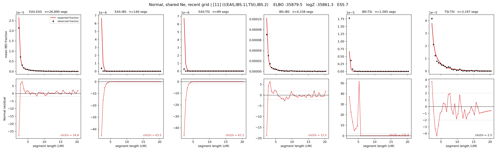

# `(((EAS,IBS.1),TSI),IBS.2)`

**Normal, shared Ne, recent grid** | topology 11 of 21 | admixed leaf: **IBS** | 4 events, 8 nodes

> Recent Ne grid: 0-5 and 5-10 generations. The first demographic event is explicitly constrained to occur after generation 10 (minimum 11 with the current one-generation gap).

## Model score

| quantity | value | |
|---|---|---|
| ELBO | -35879.49 | +- 0.32 (MC) |
| logZ (importance sampling) | -35861.27 | |
| ESS of the IS weights | 6.7 / 4000 | LOW -- treat logZ with suspicion |
| Stan dropped-constant correction | -29.61 | already applied |
| seed kept / runtime | 1 | 23 s |

## Events (in temporal order, most recent first)

| # | type | detail | time (gen) | cumulative |
|---|---|---|---|---|
| 1 | ADMIXTURE | IBS -> IBS.1 + IBS.2 | 191.7 +- 0.5 | 191.7 |
| 2 | MERGE | IBS.2 + EAS -> n1 | 1.0 +- 0.0 | 192.8 |
| 3 | MERGE | n1 + TSI -> n2 | 1.5 +- 0.0 | 194.2 |
| 4 | MERGE | IBS.1 + n2 -> root | 1.0 +- 0.0 | 195.2 |

## Admixture fraction

**f = 1.000 +- 0.000** (fraction from `IBS.1`; 0.000 from `IBS.2`)

Collapsed to a tree: one source carries <5% of the ancestry, so this graph is behaving as its no-admixture special case.

## Recent effective sizes shared by IBD and SNP (haploid)

| population | 0-5 gen | 5-10 gen |
|---|---:|---:|
| `EAS` | 7,307,251 | 6,260,999 |
| `IBS` | 19,745,931 | 11,672,196 |
| `TSI` | 92,390,419 | 69,130,702 |

## Effective sizes shared by IBD and SNP (haploid)

| node | Ne | sd of log Ne |
|---|---|---|
| `EAS` | 2,359,246 | 0.03 |
| `IBS` | 574,611 | 0.04 |
| `TSI` | 315,590 | 0.03 |
| `IBS.1` | 138 | 0.07 |
| `IBS.2` | 293 | 0.04 |
| `n1` | 293 | 0.04 |
| `n2` | 30,648 | 0.01 |
| `root` | 12,939 | 0.02 |

log-Ne random-walk step scale tau = 2.661

## Fit quality by component

| component | log-likelihood | n terms | chi2/n |
|---|---|---|---|
| IBD | -1,236.3 | 222 | 50.39 |
| SNP | -34,229.2 | 6 | 11424.27 |

IBD chi2/n uses Palamara model-derived Normal variance; SNP chi2/n uses its block SEs. Values near 1 indicate residuals on the modeled noise scale.

## SNP covariance residuals `(w_hat - W_pred)/w_se`

| | EAS | IBS | TSI |
|---|---|---|---|
| **EAS** | +110.10 | -96.31 | -121.40 |
| **IBS** | -96.31 | +47.86 | +145.30 |
| **TSI** | -121.40 | +145.30 | +94.78 |

