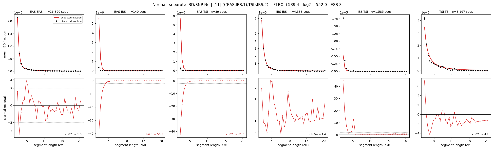

# `(((EAS,IBS.1),TSI),IBS.2)`

**Normal, separate IBD/SNP Ne** | topology 11 of 21 | admixed leaf: **IBS** | 4 events, 8 nodes

## Model score

| quantity | value | |
|---|---|---|
| ELBO | +539.45 | +- 0.15 (MC) |
| logZ (importance sampling) | +552.05 | |
| ESS of the IS weights | 7.7 / 4000 | LOW -- treat logZ with suspicion |
| Stan dropped-constant correction | -29.78 | already applied |
| mode kept / MAP start / runtime | 1 / 11 | 22 s |
| mode search | 12/12 MAP starts succeeded | 3 distinct modes evaluated |

## Events (in temporal order, most recent first)

| # | type | detail | time (gen) | cumulative |
|---|---|---|---|---|
| 1 | ADMIXTURE | IBS -> IBS.1 + IBS.2 | 79.9 +- 0.4 | 79.9 |
| 2 | MERGE | IBS.2 + EAS -> n1 | 48.8 +- 0.5 | 128.6 |
| 3 | MERGE | n1 + TSI -> n2 | 16.3 +- 0.2 | 145.0 |
| 4 | MERGE | IBS.1 + n2 -> root | 1.0 +- 0.0 | 146.0 |

## Admixture fraction

**f = 1.000 +- 0.000** (fraction from `IBS.1`; 0.000 from `IBS.2`)

Collapsed to a tree: one source carries <5% of the ancestry, so this graph is behaving as its no-admixture special case.

## Effective sizes for IBD (haploid)

| node | Ne | sd of log Ne |
|---|---|---|
| `EAS` | 2,708,220 | 0.03 |
| `IBS` | 841,137 | 0.05 |
| `TSI` | 329,640 | 0.02 |
| `IBS.1` | 49,331 | 0.03 |
| `IBS.2` | 23,070 | 0.03 |
| `n1` | 25,700 | 0.03 |
| `n2` | 94,026 | 0.01 |
| `root` | 80,140 | 0.01 |

log-Ne random-walk step scale tau_ibd = 1.256

## Effective sizes for SNP (haploid)

| node | Ne | sd of log Ne |
|---|---|---|
| `EAS` | 719 | 0.01 |
| `IBS` | 170,956 | 0.02 |
| `TSI` | 102,444 | 0.05 |
| `IBS.1` | 78,604 | 0.01 |
| `IBS.2` | 14,835 | 0.01 |
| `n1` | 12,011 | 0.01 |
| `n2` | 18,166 | 0.01 |
| `root` | 18,832 | 0.01 |

log-Ne random-walk step scale tau_snp = 0.891

## Fit quality by component

| component | log-likelihood | n terms | chi2/n |
|---|---|---|---|
| IBD | +695.5 | 222 | 32.11 |
| SNP | +41.1 | 6 | 0.84 |

IBD chi2/n uses Palamara model-derived Normal variance; SNP chi2/n uses its block SEs. Values near 1 indicate residuals on the modeled noise scale.

## SNP covariance residuals `(w_hat - W_pred)/w_se`

| | EAS | IBS | TSI |
|---|---|---|---|
| **EAS** | +0.00 | +0.03 | -0.04 |
| **IBS** | +0.03 | -0.16 | +0.11 |
| **TSI** | -0.04 | +0.11 | -0.03 |

