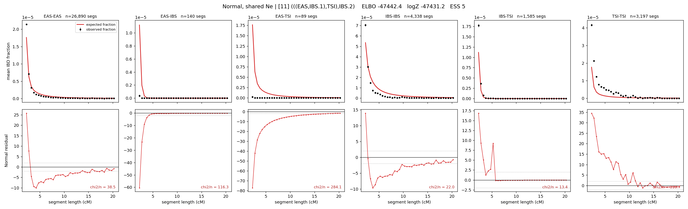

# `(((EAS,IBS.1),TSI),IBS.2)`

**Normal, shared Ne** | topology 11 of 21 | admixed leaf: **IBS** | 4 events, 8 nodes

## Model score

| quantity | value | |
|---|---|---|
| ELBO | -47442.45 | +- 0.14 (MC) |
| logZ (importance sampling) | -47431.21 | |
| ESS of the IS weights | 5.0 / 4000 | LOW -- treat logZ with suspicion |
| Stan dropped-constant correction | -24.10 | already applied |
| seed kept / runtime | 13 | 5 s |

## Events (in temporal order, most recent first)

| # | type | detail | time (gen) | cumulative |
|---|---|---|---|---|
| 1 | ADMIXTURE | IBS -> IBS.1 + IBS.2 | 1.0 +- 0.0 | 1.0 |
| 2 | MERGE | IBS.2 + EAS -> n1 | 1.0 +- 0.0 | 2.0 |
| 3 | MERGE | n1 + TSI -> n2 | 1.0 +- 0.0 | 3.0 |
| 4 | MERGE | IBS.1 + n2 -> root | 166.2 +- 0.5 | 169.2 |

## Admixture fraction

**f = 0.999 +- 0.000** (fraction from `IBS.1`; 0.001 from `IBS.2`)

Collapsed to a tree: one source carries <5% of the ancestry, so this graph is behaving as its no-admixture special case.

## Effective sizes shared by IBD and SNP (haploid)

| node | Ne | sd of log Ne |
|---|---|---|
| `EAS` | 1,525,036 | 0.02 |
| `IBS` | 231,462 | 0.02 |
| `TSI` | 1,505,454 | 0.02 |
| `IBS.1` | 231,092 | 0.02 |
| `IBS.2` | 1,522,229 | 0.02 |
| `n1` | 1,522,500 | 0.02 |
| `n2` | 1,519,336 | 0.02 |
| `root` | 18,544 | 0.01 |

log-Ne random-walk step scale tau = 0.694

## Fit quality by component

| component | log-likelihood | n terms | chi2/n |
|---|---|---|---|
| IBD | -7,410.0 | 222 | 98.92 |
| SNP | -39,835.3 | 6 | 13292.98 |

IBD chi2/n uses Palamara model-derived Normal variance; SNP chi2/n uses its block SEs. Values near 1 indicate residuals on the modeled noise scale.

## SNP covariance residuals `(w_hat - W_pred)/w_se`

| | EAS | IBS | TSI |
|---|---|---|---|
| **EAS** | +117.52 | -115.27 | -117.03 |
| **IBS** | -115.27 | +111.89 | +115.37 |
| **TSI** | -117.03 | +115.37 | +114.60 |

