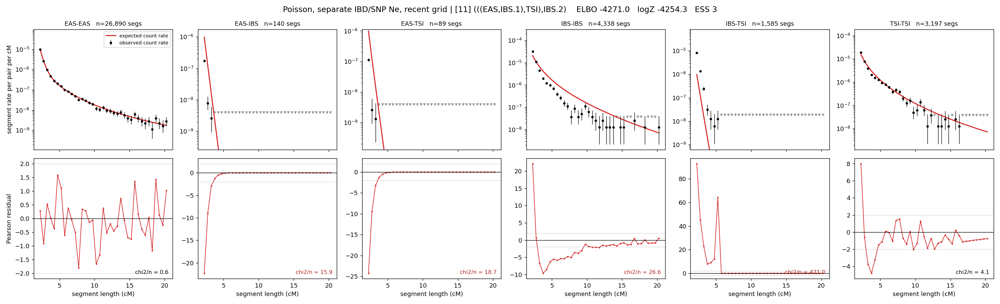

# `(((EAS,IBS.1),TSI),IBS.2)`

**Poisson, separate IBD/SNP Ne, recent grid** | topology 11 of 21 | admixed leaf: **IBS** | 4 events, 8 nodes

> Recent Ne grid: 0-5 and 5-10 generations. The first demographic event is explicitly constrained to occur after generation 10 (minimum 11 with the current one-generation gap).

## Model score

| quantity | value | |
|---|---|---|
| ELBO | -4270.98 | +- 0.19 (MC) |
| logZ (importance sampling) | -4254.25 | |
| ESS of the IS weights | 2.9 / 4000 | LOW -- treat logZ with suspicion |
| Stan dropped-constant correction | -40.81 | already applied |
| seed kept / runtime | 13 | 23 s |

## Events (in temporal order, most recent first)

| # | type | detail | time (gen) | cumulative |
|---|---|---|---|---|
| 1 | ADMIXTURE | IBS -> IBS.1 + IBS.2 | 11.0 +- 0.0 | 11.0 |
| 2 | MERGE | IBS.2 + EAS -> n1 | 123.1 +- 0.3 | 134.1 |
| 3 | MERGE | n1 + TSI -> n2 | 47.9 +- 0.4 | 182.0 |
| 4 | MERGE | IBS.1 + n2 -> root | 1.0 +- 0.0 | 183.0 |

## Admixture fraction

**f = 1.000 +- 0.000** (fraction from `IBS.1`; 0.000 from `IBS.2`)

Collapsed to a tree: one source carries <5% of the ancestry, so this graph is behaving as its no-admixture special case.

## Recent effective sizes for IBD (haploid)

| population | 0-5 gen | 5-10 gen |
|---|---:|---:|
| `EAS` | 4,014,981 | 3,750,687 |
| `IBS` | 3,762,760 | 2,694,147 |
| `TSI` | 2,144,910 | 1,470,981 |

## Effective sizes for IBD (haploid)

| node | Ne | sd of log Ne |
|---|---|---|
| `EAS` | 2,426,154 | 0.02 |
| `IBS` | 457,382 | 0.03 |
| `TSI` | 306,196 | 0.02 |
| `IBS.1` | 221,863 | 0.04 |
| `IBS.2` | 34,600 | 0.03 |
| `n1` | 33,267 | 0.03 |
| `n2` | 113,254 | 0.01 |
| `root` | 62,121 | 0.01 |

log-Ne random-walk step scale tau_ibd = 2.010

## Recent effective sizes for SNP (haploid)

| population | 0-5 gen | 5-10 gen |
|---|---:|---:|
| `EAS` | 1,235 | 1,199 |
| `IBS` | 160,068 | 154,820 |
| `TSI` | 133,797 | 130,934 |

## Effective sizes for SNP (haploid)

| node | Ne | sd of log Ne |
|---|---|---|
| `EAS` | 1,047 | 0.01 |
| `IBS` | 134,070 | 0.05 |
| `TSI` | 121,610 | 0.05 |
| `IBS.1` | 135,950 | 0.05 |
| `IBS.2` | 893 | 0.01 |
| `n1` | 893 | 0.01 |
| `n2` | 11,734 | 0.01 |
| `root` | 11,998 | 0.01 |

log-Ne random-walk step scale tau_snp = 1.137

## Fit quality by component

| component | log-likelihood | n terms | chi2/n |
|---|---|---|---|
| IBD | -4,002.2 | 222 | 81.36 |
| SNP | +38.7 | 6 | 1.65 |

IBD chi2/n uses Poisson counting variance; SNP chi2/n uses its block SEs. Values near 1 indicate residuals on the modeled noise scale.

## SNP covariance residuals `(w_hat - W_pred)/w_se`

| | EAS | IBS | TSI |
|---|---|---|---|
| **EAS** | -0.02 | +0.04 | -0.00 |
| **IBS** | +0.04 | -0.34 | +0.28 |
| **TSI** | -0.00 | +0.28 | -0.26 |

