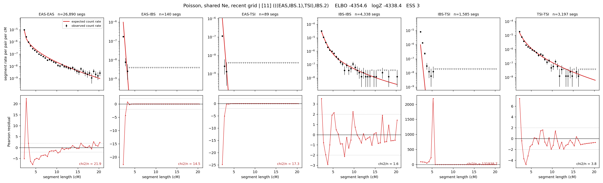

# `(((EAS,IBS.1),TSI),IBS.2)`

**Poisson, shared Ne, recent grid** | topology 11 of 21 | admixed leaf: **IBS** | 4 events, 8 nodes

> Recent Ne grid: 0-5 and 5-10 generations. The first demographic event is explicitly constrained to occur after generation 10 (minimum 11 with the current one-generation gap).

## Model score

| quantity | value | |
|---|---|---|
| ELBO | -4354.58 | +- 0.23 (MC) |
| logZ (importance sampling) | -4338.41 | |
| ESS of the IS weights | 2.8 / 4000 | LOW -- treat logZ with suspicion |
| Stan dropped-constant correction | -29.61 | already applied |
| mode kept / MAP start / runtime | 2 / 8 | 26 s |
| mode search | 12/12 MAP starts succeeded | 3 distinct modes evaluated |

## Events (in temporal order, most recent first)

| # | type | detail | time (gen) | cumulative |
|---|---|---|---|---|
| 1 | ADMIXTURE | IBS -> IBS.1 + IBS.2 | 71.5 +- 1.9 | 71.5 |
| 2 | MERGE | IBS.2 + EAS -> n1 | 220.8 +- 2.0 | 292.3 |
| 3 | MERGE | n1 + TSI -> n2 | 8.8 +- 0.1 | 301.1 |
| 4 | MERGE | IBS.1 + n2 -> root | 1.0 +- 0.0 | 302.2 |

## Admixture fraction

**f = 1.000 +- 0.000** (fraction from `IBS.1`; 0.000 from `IBS.2`)

Collapsed to a tree: one source carries <5% of the ancestry, so this graph is behaving as its no-admixture special case.

## Recent effective sizes shared by IBD and SNP (haploid)

| population | 0-5 gen | 5-10 gen |
|---|---:|---:|
| `EAS` | 53,850,476 | 32,586,471 |
| `IBS` | 3,710,414 | 2,835,924 |
| `TSI` | 3,584,729 | 2,221,779 |

## Effective sizes shared by IBD and SNP (haploid)

| node | Ne | sd of log Ne |
|---|---|---|
| `EAS` | 1,581,909 | 0.03 |
| `IBS` | 791,817 | 0.13 |
| `TSI` | 306,002 | 0.03 |
| `IBS.1` | 68,559 | 0.04 |
| `IBS.2` | 46,876,946,014 | 0.19 |
| `n1` | 49 | 0.01 |
| `n2` | 1,279 | 0.02 |
| `root` | 862 | 0.02 |

log-Ne random-walk step scale tau = 2.542

## Fit quality by component

| component | log-likelihood | n terms | chi2/n |
|---|---|---|---|
| IBD | -4,112.3 | 222 | 22052.51 |
| SNP | +11.0 | 6 | 10.89 |

IBD chi2/n uses Poisson counting variance; SNP chi2/n uses its block SEs. Values near 1 indicate residuals on the modeled noise scale.

## SNP covariance residuals `(w_hat - W_pred)/w_se`

| | EAS | IBS | TSI |
|---|---|---|---|
| **EAS** | +0.72 | +0.92 | -2.35 |
| **IBS** | +0.92 | -5.83 | +4.37 |
| **TSI** | -2.35 | +4.37 | +0.37 |

