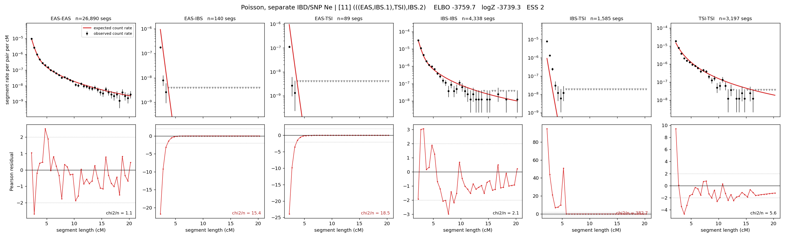

# `(((EAS,IBS.1),TSI),IBS.2)`

**Poisson, separate IBD/SNP Ne** | topology 11 of 21 | admixed leaf: **IBS** | 4 events, 8 nodes

## Model score

| quantity | value | |
|---|---|---|
| ELBO | -3759.71 | +- 0.20 (MC) |
| logZ (importance sampling) | -3739.31 | |
| ESS of the IS weights | 1.8 / 4000 | LOW -- treat logZ with suspicion |
| Stan dropped-constant correction | -29.78 | already applied |
| seed kept / runtime | 1 | 18 s |

## Events (in temporal order, most recent first)

| # | type | detail | time (gen) | cumulative |
|---|---|---|---|---|
| 1 | ADMIXTURE | IBS -> IBS.1 + IBS.2 | 126.4 +- 0.9 | 126.4 |
| 2 | MERGE | IBS.2 + EAS -> n1 | 1.0 +- 0.0 | 127.4 |
| 3 | MERGE | n1 + TSI -> n2 | 46.2 +- 0.2 | 173.6 |
| 4 | MERGE | IBS.1 + n2 -> root | 1.0 +- 0.0 | 174.6 |

## Admixture fraction

**f = 1.000 +- 0.000** (fraction from `IBS.1`; 0.000 from `IBS.2`)

Collapsed to a tree: one source carries <5% of the ancestry, so this graph is behaving as its no-admixture special case.

## Effective sizes for IBD (haploid)

| node | Ne | sd of log Ne |
|---|---|---|
| `EAS` | 2,641,464 | 0.04 |
| `IBS` | 608,878 | 0.07 |
| `TSI` | 319,371 | 0.03 |
| `IBS.1` | 11,619 | 0.04 |
| `IBS.2` | 39,314 | 0.03 |
| `n1` | 39,314 | 0.03 |
| `n2` | 95,784 | 0.04 |
| `root` | 85,162 | 0.04 |

log-Ne random-walk step scale tau_ibd = 0.762

## Effective sizes for SNP (haploid)

| node | Ne | sd of log Ne |
|---|---|---|
| `EAS` | 770 | 0.01 |
| `IBS` | 137,654 | 0.10 |
| `TSI` | 223,392 | 0.05 |
| `IBS.1` | 45,739 | 0.06 |
| `IBS.2` | 3,111 | 0.01 |
| `n1` | 3,111 | 0.01 |
| `n2` | 15,649 | 0.03 |
| `root` | 16,106 | 0.03 |

log-Ne random-walk step scale tau_snp = 0.801

## Fit quality by component

| component | log-likelihood | n terms | chi2/n |
|---|---|---|---|
| IBD | -3,561.2 | 222 | 71.05 |
| SNP | +38.0 | 6 | 1.87 |

IBD chi2/n uses Poisson counting variance; SNP chi2/n uses its block SEs. Values near 1 indicate residuals on the modeled noise scale.

## SNP covariance residuals `(w_hat - W_pred)/w_se`

| | EAS | IBS | TSI |
|---|---|---|---|
| **EAS** | +0.07 | +0.60 | -0.74 |
| **IBS** | +0.60 | -1.37 | +0.24 |
| **TSI** | -0.74 | +0.24 | +1.20 |

