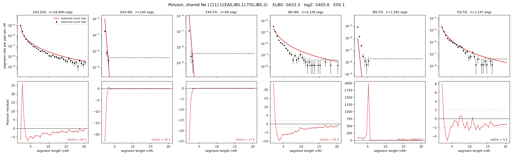

# `(((EAS,IBS.1),TSI),IBS.2)`

**Poisson, shared Ne** | topology 11 of 21 | admixed leaf: **IBS** | 4 events, 8 nodes

## Model score

| quantity | value | |
|---|---|---|
| ELBO | -5633.28 | +- 5.07 (MC) |
| logZ (importance sampling) | -5405.64 | |
| ESS of the IS weights | 1.3 / 4000 | LOW -- treat logZ with suspicion |
| Stan dropped-constant correction | -24.10 | already applied |
| seed kept / runtime | 1 | 17 s |

## Events (in temporal order, most recent first)

| # | type | detail | time (gen) | cumulative |
|---|---|---|---|---|
| 1 | ADMIXTURE | IBS -> IBS.1 + IBS.2 | 292.3 +- 2.6 | 292.3 |
| 2 | MERGE | IBS.2 + EAS -> n1 | 1.0 +- 0.0 | 293.3 |
| 3 | MERGE | n1 + TSI -> n2 | 4.4 +- 1.4 | 297.7 |
| 4 | MERGE | IBS.1 + n2 -> root | 1.0 +- 0.0 | 298.7 |

## Admixture fraction

**f = 1.000 +- 0.000** (fraction from `IBS.1`; 0.000 from `IBS.2`)

Collapsed to a tree: one source carries <5% of the ancestry, so this graph is behaving as its no-admixture special case.

## Effective sizes shared by IBD and SNP (haploid)

| node | Ne | sd of log Ne |
|---|---|---|
| `EAS` | 1,751,217 | 0.10 |
| `IBS` | 237,117 | 0.14 |
| `TSI` | 321,378 | 0.16 |
| `IBS.1` | 36,455,644 | 1.81 |
| `IBS.2` | 25 | 0.41 |
| `n1` | 24 | 0.42 |
| `n2` | 1,837 | 0.12 |
| `root` | 998 | 0.04 |

log-Ne random-walk step scale tau = 1.615

## Fit quality by component

| component | log-likelihood | n terms | chi2/n |
|---|---|---|---|
| IBD | -5,067.6 | 222 | 18836.39 |
| SNP | +28.7 | 6 | 4.96 |

IBD chi2/n uses Poisson counting variance; SNP chi2/n uses its block SEs. Values near 1 indicate residuals on the modeled noise scale.

## SNP covariance residuals `(w_hat - W_pred)/w_se`

| | EAS | IBS | TSI |
|---|---|---|---|
| **EAS** | +0.18 | +0.30 | -0.65 |
| **IBS** | +0.30 | -0.81 | +0.25 |
| **TSI** | -0.65 | +0.25 | +1.01 |

