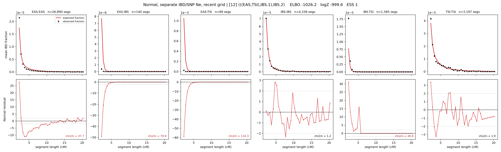

# `(((EAS,TSI),IBS.1),IBS.2)`

**Normal, separate IBD/SNP Ne, recent grid** | topology 12 of 21 | admixed leaf: **IBS** | 4 events, 8 nodes

> Recent Ne grid: 0-5 and 5-10 generations. The first demographic event is explicitly constrained to occur after generation 10 (minimum 11 with the current one-generation gap).

> Graph where the two NON-admixed leaves merge first. Excluded by the 'first merge must involve an admixture branch' rule; included here because it is the standard local-clade + deep-source scenario.

## Model score

| quantity | value | |
|---|---|---|
| ELBO | -1026.17 | +- 0.28 (MC) |
| logZ (importance sampling) | -999.56 | |
| ESS of the IS weights | 1.1 / 4000 | LOW -- treat logZ with suspicion |
| Stan dropped-constant correction | -40.81 | already applied |
| mode kept / MAP start / runtime | 1 / 11 | 28 s |
| mode search | 12/12 MAP starts succeeded | 3 distinct modes evaluated |

## Events (in temporal order, most recent first)

| # | type | detail | time (gen) | cumulative |
|---|---|---|---|---|
| 1 | ADMIXTURE | IBS -> IBS.1 + IBS.2 | 87.6 +- 0.3 | 87.6 |
| 2 | MERGE | EAS + TSI -> n1 | 75.4 +- 0.7 | 163.0 |
| 3 | MERGE | IBS.2 + n1 -> n2 | 1.6 +- 0.0 | 164.6 |
| 4 | MERGE | IBS.1 + n2 -> root | 16.5 +- 0.2 | 181.1 |

## Admixture fraction

**f = 0.265 +- 0.004** (fraction from `IBS.1`; 0.735 from `IBS.2`)

## Recent effective sizes for IBD (haploid)

| population | 0-5 gen | 5-10 gen |
|---|---:|---:|
| `EAS` | 35,934,349 | 19,080,270 |
| `IBS` | 1,243,381 | 1,327,160 |
| `TSI` | 1,300,654 | 1,022,030 |

## Effective sizes for IBD (haploid)

| node | Ne | sd of log Ne |
|---|---|---|
| `EAS` | 1,393,869 | 0.03 |
| `IBS` | 757,389 | 0.07 |
| `TSI` | 349,621 | 0.02 |
| `IBS.1` | 141,595 | 0.04 |
| `IBS.2` | 23,411 | 0.04 |
| `n1` | 17,260 | 0.03 |
| `n2` | 13,650 | 0.03 |
| `root` | 64,408 | 0.02 |

log-Ne random-walk step scale tau_ibd = 2.018

## Recent effective sizes for SNP (haploid)

| population | 0-5 gen | 5-10 gen |
|---|---:|---:|
| `EAS` | 926 | 971 |
| `IBS` | 154,144 | 146,202 |
| `TSI` | 116,091 | 101,819 |

## Effective sizes for SNP (haploid)

| node | Ne | sd of log Ne |
|---|---|---|
| `EAS` | 902 | 0.01 |
| `IBS` | 166,032 | 0.03 |
| `TSI` | 107,104 | 0.04 |
| `IBS.1` | 54,485 | 0.02 |
| `IBS.2` | 49,975 | 0.02 |
| `n1` | 21,984 | 0.01 |
| `n2` | 23,685 | 0.01 |
| `root` | 25,778 | 0.01 |

log-Ne random-walk step scale tau_snp = 0.944

## Fit quality by component

| component | log-likelihood | n terms | chi2/n |
|---|---|---|---|
| IBD | -793.2 | 222 | 45.75 |
| SNP | +39.3 | 6 | 1.43 |

IBD chi2/n uses Palamara model-derived Normal variance; SNP chi2/n uses its block SEs. Values near 1 indicate residuals on the modeled noise scale.

## SNP covariance residuals `(w_hat - W_pred)/w_se`

| | EAS | IBS | TSI |
|---|---|---|---|
| **EAS** | +0.07 | +0.04 | -0.17 |
| **IBS** | +0.04 | -0.71 | +0.68 |
| **TSI** | -0.17 | +0.68 | -0.31 |

