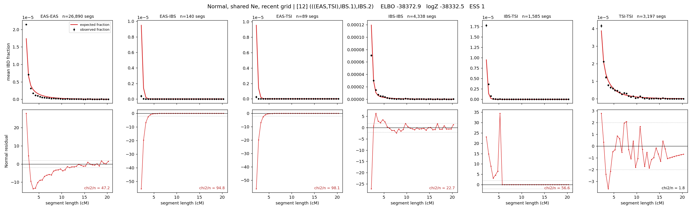

# `(((EAS,TSI),IBS.1),IBS.2)`

**Normal, shared Ne, recent grid** | topology 12 of 21 | admixed leaf: **IBS** | 4 events, 8 nodes

> Recent Ne grid: 0-5 and 5-10 generations. The first demographic event is explicitly constrained to occur after generation 10 (minimum 11 with the current one-generation gap).

> Graph where the two NON-admixed leaves merge first. Excluded by the 'first merge must involve an admixture branch' rule; included here because it is the standard local-clade + deep-source scenario.

## Model score

| quantity | value | |
|---|---|---|
| ELBO | -38372.86 | +- 0.42 (MC) |
| logZ (importance sampling) | -38332.51 | |
| ESS of the IS weights | 1.0 / 4000 | LOW -- treat logZ with suspicion |
| Stan dropped-constant correction | -29.61 | already applied |
| seed kept / runtime | 1 | 24 s |

## Events (in temporal order, most recent first)

| # | type | detail | time (gen) | cumulative |
|---|---|---|---|---|
| 1 | ADMIXTURE | IBS -> IBS.1 + IBS.2 | 184.0 +- 0.6 | 184.0 |
| 2 | MERGE | EAS + TSI -> n1 | 1.5 +- 0.1 | 185.5 |
| 3 | MERGE | IBS.2 + n1 -> n2 | 1.3 +- 0.0 | 186.7 |
| 4 | MERGE | IBS.1 + n2 -> root | 1.1 +- 0.0 | 187.8 |

## Admixture fraction

**f = 1.000 +- 0.000** (fraction from `IBS.1`; 0.000 from `IBS.2`)

Collapsed to a tree: one source carries <5% of the ancestry, so this graph is behaving as its no-admixture special case.

## Recent effective sizes shared by IBD and SNP (haploid)

| population | 0-5 gen | 5-10 gen |
|---|---:|---:|
| `EAS` | 20,843,051 | 11,519,634 |
| `IBS` | 4,000,325 | 3,071,870 |
| `TSI` | 3,981,905 | 1,908,048 |

## Effective sizes shared by IBD and SNP (haploid)

| node | Ne | sd of log Ne |
|---|---|---|
| `EAS` | 1,252,254 | 0.04 |
| `IBS` | 673,607 | 0.09 |
| `TSI` | 336,998 | 0.07 |
| `IBS.1` | 160 | 0.04 |
| `IBS.2` | 105,456 | 0.02 |
| `n1` | 283,124 | 0.03 |
| `n2` | 105,944 | 0.02 |
| `root` | 11,661 | 0.02 |

log-Ne random-walk step scale tau = 1.403

## Fit quality by component

| component | log-likelihood | n terms | chi2/n |
|---|---|---|---|
| IBD | -1,633.1 | 222 | 53.73 |
| SNP | -36,252.8 | 6 | 12098.81 |

IBD chi2/n uses Palamara model-derived Normal variance; SNP chi2/n uses its block SEs. Values near 1 indicate residuals on the modeled noise scale.

## SNP covariance residuals `(w_hat - W_pred)/w_se`

| | EAS | IBS | TSI |
|---|---|---|---|
| **EAS** | +113.55 | -100.39 | -124.13 |
| **IBS** | -100.39 | +54.51 | +146.50 |
| **TSI** | -124.13 | +146.50 | +98.86 |

