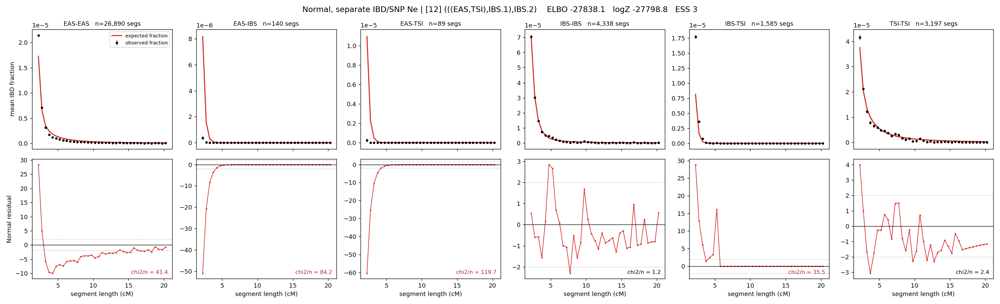

# `(((EAS,TSI),IBS.1),IBS.2)`

**Normal, separate IBD/SNP Ne** | topology 12 of 21 | admixed leaf: **IBS** | 4 events, 8 nodes

> Graph where the two NON-admixed leaves merge first. Excluded by the 'first merge must involve an admixture branch' rule; included here because it is the standard local-clade + deep-source scenario.

## Model score

| quantity | value | |
|---|---|---|
| ELBO | -27838.15 | +- 0.58 (MC) |
| logZ (importance sampling) | -27798.79 | |
| ESS of the IS weights | 2.9 / 4000 | LOW -- treat logZ with suspicion |
| Stan dropped-constant correction | -29.78 | already applied |
| seed kept / runtime | 13 | 18 s |

## Events (in temporal order, most recent first)

| # | type | detail | time (gen) | cumulative |
|---|---|---|---|---|
| 1 | ADMIXTURE | IBS -> IBS.1 + IBS.2 | 80.7 +- 0.5 | 80.7 |
| 2 | MERGE | EAS + TSI -> n1 | 77.1 +- 1.0 | 157.8 |
| 3 | MERGE | IBS.2 + n1 -> n2 | 1.0 +- 0.0 | 158.8 |
| 4 | MERGE | IBS.1 + n2 -> root | 1.0 +- 0.0 | 159.8 |

## Admixture fraction

**f = 1.000 +- 0.000** (fraction from `IBS.1`; 0.000 from `IBS.2`)

Collapsed to a tree: one source carries <5% of the ancestry, so this graph is behaving as its no-admixture special case.

## Effective sizes for IBD (haploid)

| node | Ne | sd of log Ne |
|---|---|---|
| `EAS` | 1,534,753 | 0.05 |
| `IBS` | 845,796 | 0.12 |
| `TSI` | 366,058 | 0.06 |
| `IBS.1` | 52,217 | 0.08 |
| `IBS.2` | 8,852 | 0.06 |
| `n1` | 5,845 | 0.06 |
| `n2` | 8,846 | 0.06 |
| `root` | 34,703 | 0.04 |

log-Ne random-walk step scale tau_ibd = 1.993

## Effective sizes for SNP (haploid)

| node | Ne | sd of log Ne |
|---|---|---|
| `EAS` | 5,633 | 0.03 |
| `IBS` | 5,633 | 0.03 |
| `TSI` | 5,633 | 0.03 |
| `IBS.1` | 5,633 | 0.03 |
| `IBS.2` | 5,633 | 0.03 |
| `n1` | 5,633 | 0.03 |
| `n2` | 5,633 | 0.03 |
| `root` | 5,633 | 0.03 |

log-Ne random-walk step scale tau_snp = 0.000

## Fit quality by component

| component | log-likelihood | n terms | chi2/n |
|---|---|---|---|
| IBD | -1,023.0 | 222 | 47.64 |
| SNP | -26,573.8 | 6 | 8872.49 |

IBD chi2/n uses Palamara model-derived Normal variance; SNP chi2/n uses its block SEs. Values near 1 indicate residuals on the modeled noise scale.

## SNP covariance residuals `(w_hat - W_pred)/w_se`

| | EAS | IBS | TSI |
|---|---|---|---|
| **EAS** | +90.22 | -88.44 | -89.89 |
| **IBS** | -88.44 | +9.68 | +170.15 |
| **TSI** | -89.89 | +170.15 | +11.33 |

