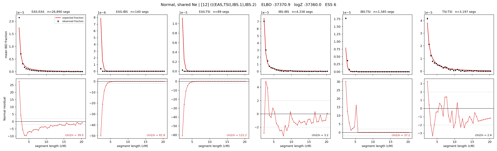

# `(((EAS,TSI),IBS.1),IBS.2)`

**Normal, shared Ne** | topology 12 of 21 | admixed leaf: **IBS** | 4 events, 8 nodes

> Graph where the two NON-admixed leaves merge first. Excluded by the 'first merge must involve an admixture branch' rule; included here because it is the standard local-clade + deep-source scenario.

## Model score

| quantity | value | |
|---|---|---|
| ELBO | -37370.93 | +- 0.12 (MC) |
| logZ (importance sampling) | -37360.05 | |
| ESS of the IS weights | 5.6 / 4000 | LOW -- treat logZ with suspicion |
| Stan dropped-constant correction | -24.10 | already applied |
| mode kept / MAP start / runtime | 1 / 11 | 20 s |
| mode search | 12/12 MAP starts succeeded | 3 distinct modes evaluated |

## Events (in temporal order, most recent first)

| # | type | detail | time (gen) | cumulative |
|---|---|---|---|---|
| 1 | ADMIXTURE | IBS -> IBS.1 + IBS.2 | 158.7 +- 0.5 | 158.7 |
| 2 | MERGE | EAS + TSI -> n1 | 1.5 +- 0.0 | 160.2 |
| 3 | MERGE | IBS.2 + n1 -> n2 | 4.4 +- 0.1 | 164.6 |
| 4 | MERGE | IBS.1 + n2 -> root | 27.2 +- 0.3 | 191.8 |

## Admixture fraction

**f = 0.077 +- 0.001** (fraction from `IBS.1`; 0.923 from `IBS.2`)

## Effective sizes shared by IBD and SNP (haploid)

| node | Ne | sd of log Ne |
|---|---|---|
| `EAS` | 1,549,986 | 0.03 |
| `IBS` | 529,145 | 0.04 |
| `TSI` | 359,130 | 0.05 |
| `IBS.1` | 7 | 0.03 |
| `IBS.2` | 18,520 | 0.01 |
| `n1` | 14,280 | 0.02 |
| `n2` | 19,191 | 0.01 |
| `root` | 109,265 | 0.01 |

log-Ne random-walk step scale tau = 1.869

## Fit quality by component

| component | log-likelihood | n terms | chi2/n |
|---|---|---|---|
| IBD | -1,034.7 | 222 | 47.71 |
| SNP | -36,161.1 | 6 | 12068.24 |

IBD chi2/n uses Palamara model-derived Normal variance; SNP chi2/n uses its block SEs. Values near 1 indicate residuals on the modeled noise scale.

## SNP covariance residuals `(w_hat - W_pred)/w_se`

| | EAS | IBS | TSI |
|---|---|---|---|
| **EAS** | +112.73 | -97.01 | -125.91 |
| **IBS** | -97.01 | +41.69 | +153.33 |
| **TSI** | -125.91 | +153.33 | +95.83 |

