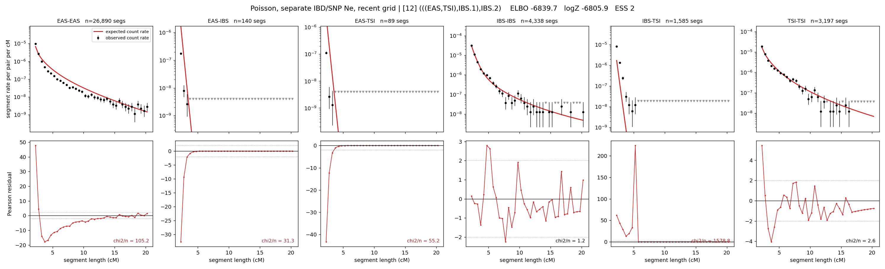

# `(((EAS,TSI),IBS.1),IBS.2)`

**Poisson, separate IBD/SNP Ne, recent grid** | topology 12 of 21 | admixed leaf: **IBS** | 4 events, 8 nodes

> Recent Ne grid: 0-5 and 5-10 generations. The first demographic event is explicitly constrained to occur after generation 10 (minimum 11 with the current one-generation gap).

> Graph where the two NON-admixed leaves merge first. Excluded by the 'first merge must involve an admixture branch' rule; included here because it is the standard local-clade + deep-source scenario.

## Model score

| quantity | value | |
|---|---|---|
| ELBO | -6839.66 | +- 0.38 (MC) |
| logZ (importance sampling) | -6805.95 | |
| ESS of the IS weights | 1.7 / 4000 | LOW -- treat logZ with suspicion |
| Stan dropped-constant correction | -40.81 | already applied |
| mode kept / MAP start / runtime | 1 / 4 | 26 s |
| mode search | 12/12 MAP starts succeeded | 3 distinct modes evaluated |

## Events (in temporal order, most recent first)

| # | type | detail | time (gen) | cumulative |
|---|---|---|---|---|
| 1 | ADMIXTURE | IBS -> IBS.1 + IBS.2 | 84.7 +- 0.5 | 84.7 |
| 2 | MERGE | EAS + TSI -> n1 | 147.7 +- 1.0 | 232.4 |
| 3 | MERGE | IBS.2 + n1 -> n2 | 2.7 +- 0.0 | 235.0 |
| 4 | MERGE | IBS.1 + n2 -> root | 113.0 +- 1.1 | 348.0 |

## Admixture fraction

**f = 0.321 +- 0.005** (fraction from `IBS.1`; 0.679 from `IBS.2`)

## Recent effective sizes for IBD (haploid)

| population | 0-5 gen | 5-10 gen |
|---|---:|---:|
| `EAS` | 48,585,329 | 25,231,506 |
| `IBS` | 1,820,258 | 1,388,575 |
| `TSI` | 2,224,228 | 1,430,103 |

## Effective sizes for IBD (haploid)

| node | Ne | sd of log Ne |
|---|---|---|
| `EAS` | 1,071,082 | 0.02 |
| `IBS` | 770,173 | 0.04 |
| `TSI` | 324,856 | 0.03 |
| `IBS.1` | 221,067 | 0.04 |
| `IBS.2` | 21,973 | 0.05 |
| `n1` | 6,669 | 0.03 |
| `n2` | 3,827 | 0.03 |
| `root` | 26,102 | 0.02 |

log-Ne random-walk step scale tau_ibd = 2.294

## Recent effective sizes for SNP (haploid)

| population | 0-5 gen | 5-10 gen |
|---|---:|---:|
| `EAS` | 1,395 | 1,280 |
| `IBS` | 276,652 | 297,704 |
| `TSI` | 143,481 | 160,048 |

## Effective sizes for SNP (haploid)

| node | Ne | sd of log Ne |
|---|---|---|
| `EAS` | 1,287 | 0.01 |
| `IBS` | 314,959 | 0.02 |
| `TSI` | 163,729 | 0.02 |
| `IBS.1` | 67,526 | 0.04 |
| `IBS.2` | 189,510 | 0.02 |
| `n1` | 32,118 | 0.01 |
| `n2` | 35,683 | 0.01 |
| `root` | 29,933 | 0.01 |

log-Ne random-walk step scale tau_snp = 0.942

## Fit quality by component

| component | log-likelihood | n terms | chi2/n |
|---|---|---|---|
| IBD | -6,580.1 | 222 | 298.05 |
| SNP | +39.5 | 6 | 1.38 |

IBD chi2/n uses Poisson counting variance; SNP chi2/n uses its block SEs. Values near 1 indicate residuals on the modeled noise scale.

## SNP covariance residuals `(w_hat - W_pred)/w_se`

| | EAS | IBS | TSI |
|---|---|---|---|
| **EAS** | +0.01 | +0.06 | -0.09 |
| **IBS** | +0.06 | -0.35 | +0.25 |
| **TSI** | -0.09 | +0.25 | -0.07 |

