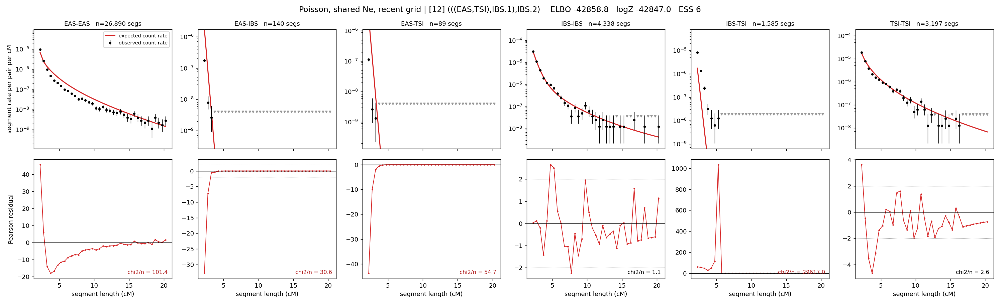

# `(((EAS,TSI),IBS.1),IBS.2)`

**Poisson, shared Ne, recent grid** | topology 12 of 21 | admixed leaf: **IBS** | 4 events, 8 nodes

> Recent Ne grid: 0-5 and 5-10 generations. The first demographic event is explicitly constrained to occur after generation 10 (minimum 11 with the current one-generation gap).

> Graph where the two NON-admixed leaves merge first. Excluded by the 'first merge must involve an admixture branch' rule; included here because it is the standard local-clade + deep-source scenario.

## Model score

| quantity | value | |
|---|---|---|
| ELBO | -42858.78 | +- 0.15 (MC) |
| logZ (importance sampling) | -42847.04 | |
| ESS of the IS weights | 5.7 / 4000 | LOW -- treat logZ with suspicion |
| Stan dropped-constant correction | -29.61 | already applied |
| mode kept / MAP start / runtime | 3 / 1 | 30 s |
| mode search | 12/12 MAP starts succeeded | 3 distinct modes evaluated |

## Events (in temporal order, most recent first)

| # | type | detail | time (gen) | cumulative |
|---|---|---|---|---|
| 1 | ADMIXTURE | IBS -> IBS.1 + IBS.2 | 84.1 +- 0.5 | 84.1 |
| 2 | MERGE | EAS + TSI -> n1 | 208.7 +- 0.7 | 292.9 |
| 3 | MERGE | IBS.2 + n1 -> n2 | 3.5 +- 0.0 | 296.4 |
| 4 | MERGE | IBS.1 + n2 -> root | 12.6 +- 0.0 | 308.9 |

## Admixture fraction

**f = 0.002 +- 0.000** (fraction from `IBS.1`; 0.998 from `IBS.2`)

Collapsed to a tree: one source carries <5% of the ancestry, so this graph is behaving as its no-admixture special case.

## Recent effective sizes shared by IBD and SNP (haploid)

| population | 0-5 gen | 5-10 gen |
|---|---:|---:|
| `EAS` | 61,810,562 | 34,405,712 |
| `IBS` | 2,654,262 | 1,672,459 |
| `TSI` | 2,986,430 | 1,743,477 |

## Effective sizes shared by IBD and SNP (haploid)

| node | Ne | sd of log Ne |
|---|---|---|
| `EAS` | 1,060,257 | 0.02 |
| `IBS` | 748,783 | 0.03 |
| `TSI` | 309,816 | 0.06 |
| `IBS.1` | 8,688 | 0.01 |
| `IBS.2` | 48,402 | 0.02 |
| `n1` | 141 | 0.02 |
| `n2` | 236 | 0.02 |
| `root` | 7,895 | 0.00 |

log-Ne random-walk step scale tau = 2.634

## Fit quality by component

| component | log-likelihood | n terms | chi2/n |
|---|---|---|---|
| IBD | -6,617.3 | 222 | 4982.92 |
| SNP | -36,033.3 | 6 | 12025.63 |

IBD chi2/n uses Poisson counting variance; SNP chi2/n uses its block SEs. Values near 1 indicate residuals on the modeled noise scale.

## SNP covariance residuals `(w_hat - W_pred)/w_se`

| | EAS | IBS | TSI |
|---|---|---|---|
| **EAS** | +112.60 | -97.28 | -125.39 |
| **IBS** | -97.28 | +42.16 | +153.38 |
| **TSI** | -125.39 | +153.38 | +94.78 |

