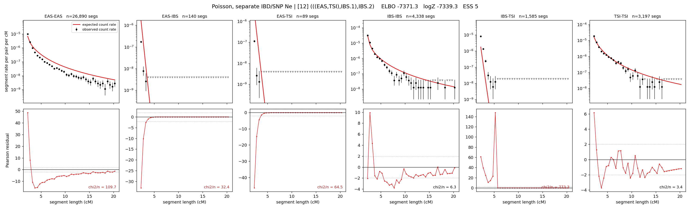

# `(((EAS,TSI),IBS.1),IBS.2)`

**Poisson, separate IBD/SNP Ne** | topology 12 of 21 | admixed leaf: **IBS** | 4 events, 8 nodes

> Graph where the two NON-admixed leaves merge first. Excluded by the 'first merge must involve an admixture branch' rule; included here because it is the standard local-clade + deep-source scenario.

## Model score

| quantity | value | |
|---|---|---|
| ELBO | -7371.30 | +- 0.39 (MC) |
| logZ (importance sampling) | -7339.31 | |
| ESS of the IS weights | 5.1 / 4000 | LOW -- treat logZ with suspicion |
| Stan dropped-constant correction | -29.78 | already applied |
| seed kept / runtime | 1 | 17 s |

## Events (in temporal order, most recent first)

| # | type | detail | time (gen) | cumulative |
|---|---|---|---|---|
| 1 | ADMIXTURE | IBS -> IBS.1 + IBS.2 | 223.8 +- 0.8 | 223.8 |
| 2 | MERGE | EAS + TSI -> n1 | 1.0 +- 0.0 | 224.8 |
| 3 | MERGE | IBS.2 + n1 -> n2 | 1.1 +- 0.0 | 225.9 |
| 4 | MERGE | IBS.1 + n2 -> root | 1.0 +- 0.0 | 226.9 |

## Admixture fraction

**f = 0.006 +- 0.000** (fraction from `IBS.1`; 0.994 from `IBS.2`)

Collapsed to a tree: one source carries <5% of the ancestry, so this graph is behaving as its no-admixture special case.

## Effective sizes for IBD (haploid)

| node | Ne | sd of log Ne |
|---|---|---|
| `EAS` | 1,202,920 | 0.04 |
| `IBS` | 438,887 | 0.08 |
| `TSI` | 344,319 | 0.04 |
| `IBS.1` | 9,537 | 0.01 |
| `IBS.2` | 47 | 0.06 |
| `n1` | 407 | 0.04 |
| `n2` | 1,149 | 0.03 |
| `root` | 9,776 | 0.01 |

log-Ne random-walk step scale tau_ibd = 3.042

## Effective sizes for SNP (haploid)

| node | Ne | sd of log Ne |
|---|---|---|
| `EAS` | 1,245 | 0.02 |
| `IBS` | 226,598 | 0.10 |
| `TSI` | 173,792 | 0.08 |
| `IBS.1` | 22,286 | 0.01 |
| `IBS.2` | 33,156 | 0.03 |
| `n1` | 28,104 | 0.01 |
| `n2` | 26,502 | 0.01 |
| `root` | 22,429 | 0.01 |

log-Ne random-walk step scale tau_snp = 0.778

## Fit quality by component

| component | log-likelihood | n terms | chi2/n |
|---|---|---|---|
| IBD | -7,112.4 | 222 | 165.55 |
| SNP | +32.6 | 6 | 3.67 |

IBD chi2/n uses Poisson counting variance; SNP chi2/n uses its block SEs. Values near 1 indicate residuals on the modeled noise scale.

## SNP covariance residuals `(w_hat - W_pred)/w_se`

| | EAS | IBS | TSI |
|---|---|---|---|
| **EAS** | -0.09 | +0.05 | +0.12 |
| **IBS** | +0.05 | +0.42 | -0.55 |
| **TSI** | +0.12 | -0.55 | +0.28 |

