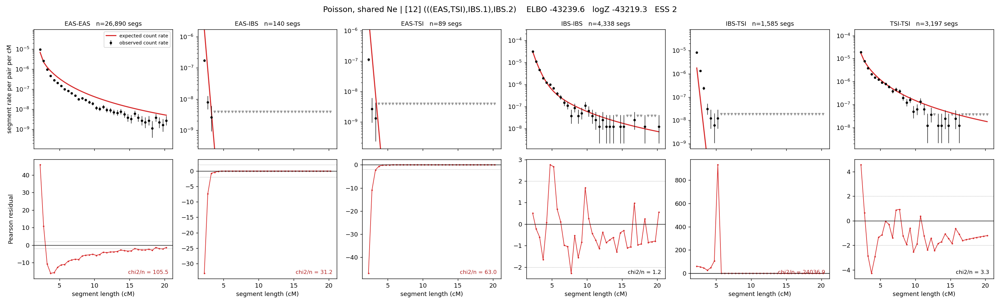

# `(((EAS,TSI),IBS.1),IBS.2)`

**Poisson, shared Ne** | topology 12 of 21 | admixed leaf: **IBS** | 4 events, 8 nodes

> Graph where the two NON-admixed leaves merge first. Excluded by the 'first merge must involve an admixture branch' rule; included here because it is the standard local-clade + deep-source scenario.

## Model score

| quantity | value | |
|---|---|---|
| ELBO | -43239.62 | +- 0.36 (MC) |
| logZ (importance sampling) | -43219.34 | |
| ESS of the IS weights | 2.4 / 4000 | LOW -- treat logZ with suspicion |
| Stan dropped-constant correction | -24.10 | already applied |
| mode kept / MAP start / runtime | 3 / 8 | 11 s |
| mode search | 11/12 MAP starts succeeded | 3 distinct modes evaluated |

## Events (in temporal order, most recent first)

| # | type | detail | time (gen) | cumulative |
|---|---|---|---|---|
| 1 | ADMIXTURE | IBS -> IBS.1 + IBS.2 | 79.2 +- 0.4 | 79.2 |
| 2 | MERGE | EAS + TSI -> n1 | 204.9 +- 1.6 | 284.1 |
| 3 | MERGE | IBS.2 + n1 -> n2 | 6.3 +- 0.3 | 290.4 |
| 4 | MERGE | IBS.1 + n2 -> root | 18.0 +- 0.2 | 308.4 |

## Admixture fraction

**f = 0.001 +- 0.000** (fraction from `IBS.1`; 0.999 from `IBS.2`)

Collapsed to a tree: one source carries <5% of the ancestry, so this graph is behaving as its no-admixture special case.

## Effective sizes shared by IBD and SNP (haploid)

| node | Ne | sd of log Ne |
|---|---|---|
| `EAS` | 1,179,441 | 0.02 |
| `IBS` | 842,687 | 0.06 |
| `TSI` | 329,625 | 0.03 |
| `IBS.1` | 806 | 0.01 |
| `IBS.2` | 54,382 | 0.02 |
| `n1` | 248 | 0.02 |
| `n2` | 408 | 0.03 |
| `root` | 3,289 | 0.01 |

log-Ne random-walk step scale tau = 1.734

## Fit quality by component

| component | log-likelihood | n terms | chi2/n |
|---|---|---|---|
| IBD | -7,043.0 | 222 | 4098.23 |
| SNP | -36,054.1 | 6 | 12032.58 |

IBD chi2/n uses Poisson counting variance; SNP chi2/n uses its block SEs. Values near 1 indicate residuals on the modeled noise scale.

## SNP covariance residuals `(w_hat - W_pred)/w_se`

| | EAS | IBS | TSI |
|---|---|---|---|
| **EAS** | +112.62 | -97.24 | -125.46 |
| **IBS** | -97.24 | +42.05 | +153.41 |
| **TSI** | -125.46 | +153.41 | +94.90 |

