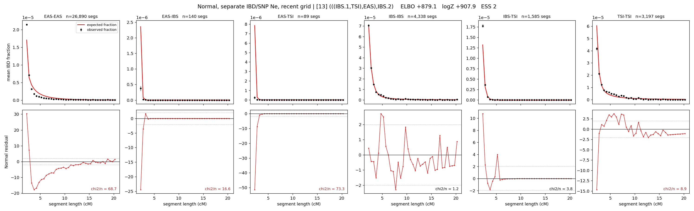

# `(((IBS.1,TSI),EAS),IBS.2)`

**Normal, separate IBD/SNP Ne, recent grid** | topology 13 of 21 | admixed leaf: **IBS** | 4 events, 8 nodes

> Recent Ne grid: 0-5 and 5-10 generations. The first demographic event is explicitly constrained to occur after generation 10 (minimum 11 with the current one-generation gap).

## Model score

| quantity | value | |
|---|---|---|
| ELBO | +879.12 | +- 0.35 (MC) |
| logZ (importance sampling) | +907.88 | |
| ESS of the IS weights | 2.1 / 4000 | LOW -- treat logZ with suspicion |
| Stan dropped-constant correction | -40.81 | already applied |
| mode kept / MAP start / runtime | 1 / 6 | 26 s |
| mode search | 12/12 MAP starts succeeded | 3 distinct modes evaluated |

## Events (in temporal order, most recent first)

| # | type | detail | time (gen) | cumulative |
|---|---|---|---|---|
| 1 | ADMIXTURE | IBS -> IBS.1 + IBS.2 | 84.1 +- 3.5 | 84.1 |
| 2 | MERGE | IBS.2 + TSI -> n1 | 36.6 +- 5.7 | 120.7 |
| 3 | MERGE | n1 + EAS -> n2 | 225.8 +- 6.8 | 346.5 |
| 4 | MERGE | IBS.1 + n2 -> root | 169.5 +- 4.0 | 516.0 |

## Admixture fraction

**f = 0.700 +- 0.009** (fraction from `IBS.1`; 0.300 from `IBS.2`)

## Recent effective sizes for IBD (haploid)

| population | 0-5 gen | 5-10 gen |
|---|---:|---:|
| `EAS` | 46,343,965 | 26,505,133 |
| `IBS` | 1,465,221 | 1,244,381 |
| `TSI` | 316,840 | 437,373 |

## Effective sizes for IBD (haploid)

| node | Ne | sd of log Ne |
|---|---|---|
| `EAS` | 1,076,058 | 0.03 |
| `IBS` | 776,222 | 0.09 |
| `TSI` | 552,872 | 0.09 |
| `IBS.1` | 26,386 | 0.11 |
| `IBS.2` | 37,291 | 0.12 |
| `n1` | 27,207 | 0.07 |
| `n2` | 21 | 0.38 |
| `root` | 8,694 | 0.17 |

log-Ne random-walk step scale tau_ibd = 2.384

## Recent effective sizes for SNP (haploid)

| population | 0-5 gen | 5-10 gen |
|---|---:|---:|
| `EAS` | 1,781 | 1,851 |
| `IBS` | 399,508 | 446,033 |
| `TSI` | 393,141 | 371,538 |

## Effective sizes for SNP (haploid)

| node | Ne | sd of log Ne |
|---|---|---|
| `EAS` | 1,928 | 0.02 |
| `IBS` | 460,245 | 0.02 |
| `TSI` | 384,819 | 0.03 |
| `IBS.1` | 582,688 | 0.02 |
| `IBS.2` | 168,856 | 0.05 |
| `n1` | 162,612 | 0.05 |
| `n2` | 68,708 | 0.02 |
| `root` | 54,676 | 0.09 |

log-Ne random-walk step scale tau_snp = 0.707

## Fit quality by component

| component | log-likelihood | n terms | chi2/n |
|---|---|---|---|
| IBD | +1,142.9 | 222 | 28.89 |
| SNP | +38.5 | 6 | 1.72 |

IBD chi2/n uses Palamara model-derived Normal variance; SNP chi2/n uses its block SEs. Values near 1 indicate residuals on the modeled noise scale.

## SNP covariance residuals `(w_hat - W_pred)/w_se`

| | EAS | IBS | TSI |
|---|---|---|---|
| **EAS** | -0.04 | +0.20 | -0.11 |
| **IBS** | +0.20 | -0.42 | +0.04 |
| **TSI** | -0.11 | +0.04 | +0.18 |

