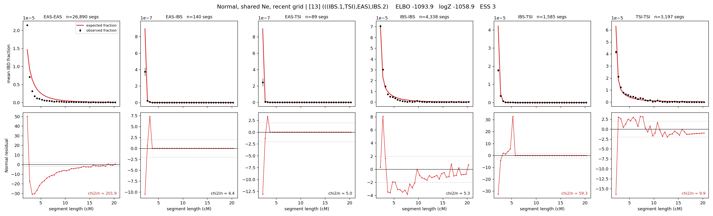

# `(((IBS.1,TSI),EAS),IBS.2)`

**Normal, shared Ne, recent grid** | topology 13 of 21 | admixed leaf: **IBS** | 4 events, 8 nodes

> Recent Ne grid: 0-5 and 5-10 generations. The first demographic event is explicitly constrained to occur after generation 10 (minimum 11 with the current one-generation gap).

## Model score

| quantity | value | |
|---|---|---|
| ELBO | -1093.86 | +- 0.50 (MC) |
| logZ (importance sampling) | -1058.92 | |
| ESS of the IS weights | 2.9 / 4000 | LOW -- treat logZ with suspicion |
| Stan dropped-constant correction | -29.61 | already applied |
| mode kept / MAP start / runtime | 3 / 3 | 27 s |
| mode search | 12/12 MAP starts succeeded | 3 distinct modes evaluated |

## Events (in temporal order, most recent first)

| # | type | detail | time (gen) | cumulative |
|---|---|---|---|---|
| 1 | ADMIXTURE | IBS -> IBS.1 + IBS.2 | 209.0 +- 0.4 | 209.0 |
| 2 | MERGE | IBS.2 + TSI -> n1 | 2.2 +- 0.1 | 211.1 |
| 3 | MERGE | n1 + EAS -> n2 | 207.7 +- 0.8 | 418.8 |
| 4 | MERGE | IBS.1 + n2 -> root | 146.5 +- 12.9 | 565.2 |

## Admixture fraction

**f = 0.002 +- 0.000** (fraction from `IBS.1`; 0.998 from `IBS.2`)

Collapsed to a tree: one source carries <5% of the ancestry, so this graph is behaving as its no-admixture special case.

## Recent effective sizes shared by IBD and SNP (haploid)

| population | 0-5 gen | 5-10 gen |
|---|---:|---:|
| `EAS` | 58,928,872 | 21,114,118 |
| `IBS` | 1,913,889 | 1,688,822 |
| `TSI` | 471,922 | 519,640 |

## Effective sizes shared by IBD and SNP (haploid)

| node | Ne | sd of log Ne |
|---|---|---|
| `EAS` | 719,334 | 0.02 |
| `IBS` | 363,879 | 0.07 |
| `TSI` | 479,056 | 0.06 |
| `IBS.1` | 28,561 | 0.06 |
| `IBS.2` | 4,811 | 0.13 |
| `n1` | 1,167 | 0.02 |
| `n2` | 1 | 0.32 |
| `root` | 9,914 | 0.03 |

log-Ne random-walk step scale tau = 2.718

## Fit quality by component

| component | log-likelihood | n terms | chi2/n |
|---|---|---|---|
| IBD | -890.0 | 222 | 47.78 |
| SNP | +27.3 | 6 | 5.43 |

IBD chi2/n uses Palamara model-derived Normal variance; SNP chi2/n uses its block SEs. Values near 1 indicate residuals on the modeled noise scale.

## SNP covariance residuals `(w_hat - W_pred)/w_se`

| | EAS | IBS | TSI |
|---|---|---|---|
| **EAS** | +1.48 | -1.03 | -1.91 |
| **IBS** | -1.03 | +0.91 | +1.13 |
| **TSI** | -1.91 | +1.13 | +2.58 |

