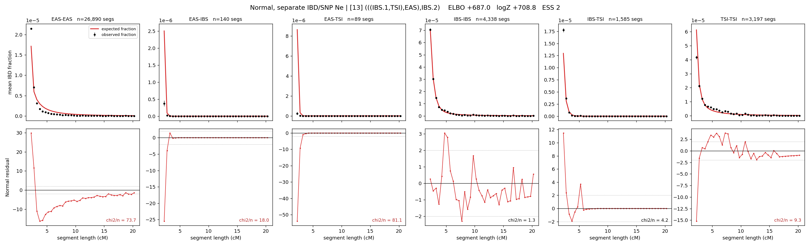

# `(((IBS.1,TSI),EAS),IBS.2)`

**Normal, separate IBD/SNP Ne** | topology 13 of 21 | admixed leaf: **IBS** | 4 events, 8 nodes

## Model score

| quantity | value | |
|---|---|---|
| ELBO | +687.02 | +- 0.33 (MC) |
| logZ (importance sampling) | +708.76 | |
| ESS of the IS weights | 2.5 / 4000 | LOW -- treat logZ with suspicion |
| Stan dropped-constant correction | -29.78 | already applied |
| mode kept / MAP start / runtime | 1 / 6 | 20 s |
| mode search | 12/12 MAP starts succeeded | 3 distinct modes evaluated |

## Events (in temporal order, most recent first)

| # | type | detail | time (gen) | cumulative |
|---|---|---|---|---|
| 1 | ADMIXTURE | IBS -> IBS.1 + IBS.2 | 84.2 +- 0.9 | 84.2 |
| 2 | MERGE | IBS.2 + TSI -> n1 | 33.6 +- 1.1 | 117.8 |
| 3 | MERGE | n1 + EAS -> n2 | 222.5 +- 1.7 | 340.3 |
| 4 | MERGE | IBS.1 + n2 -> root | 244.6 +- 2.4 | 584.9 |

## Admixture fraction

**f = 0.710 +- 0.003** (fraction from `IBS.1`; 0.290 from `IBS.2`)

## Effective sizes for IBD (haploid)

| node | Ne | sd of log Ne |
|---|---|---|
| `EAS` | 1,176,875 | 0.01 |
| `IBS` | 835,858 | 0.03 |
| `TSI` | 536,134 | 0.05 |
| `IBS.1` | 27,396 | 0.04 |
| `IBS.2` | 22,070 | 0.06 |
| `n1` | 29,752 | 0.04 |
| `n2` | 27 | 0.10 |
| `root` | 6,447 | 0.04 |

log-Ne random-walk step scale tau_ibd = 1.653

## Effective sizes for SNP (haploid)

| node | Ne | sd of log Ne |
|---|---|---|
| `EAS` | 1,892 | 0.01 |
| `IBS` | 893,382 | 0.04 |
| `TSI` | 605,619 | 0.04 |
| `IBS.1` | 1,007,974 | 0.05 |
| `IBS.2` | 128,316 | 0.03 |
| `n1` | 138,583 | 0.02 |
| `n2` | 84,166 | 0.01 |
| `root` | 27,491 | 0.02 |

log-Ne random-walk step scale tau_snp = 0.828

## Fit quality by component

| component | log-likelihood | n terms | chi2/n |
|---|---|---|---|
| IBD | +854.9 | 222 | 31.36 |
| SNP | +37.4 | 6 | 2.08 |

IBD chi2/n uses Palamara model-derived Normal variance; SNP chi2/n uses its block SEs. Values near 1 indicate residuals on the modeled noise scale.

## SNP covariance residuals `(w_hat - W_pred)/w_se`

| | EAS | IBS | TSI |
|---|---|---|---|
| **EAS** | -0.02 | +0.16 | -0.12 |
| **IBS** | +0.16 | -0.46 | +0.16 |
| **TSI** | -0.12 | +0.16 | +0.08 |

