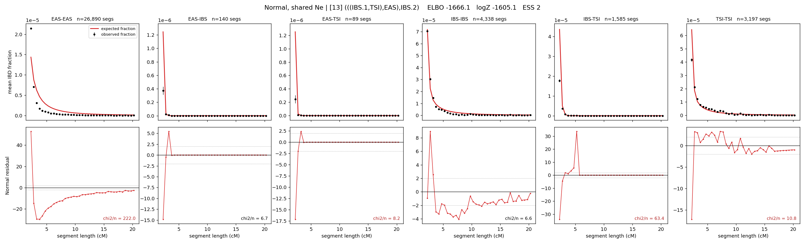

# `(((IBS.1,TSI),EAS),IBS.2)`

**Normal, shared Ne** | topology 13 of 21 | admixed leaf: **IBS** | 4 events, 8 nodes

## Model score

| quantity | value | |
|---|---|---|
| ELBO | -1666.05 | +- 0.59 (MC) |
| logZ (importance sampling) | -1605.11 | |
| ESS of the IS weights | 2.0 / 4000 | LOW -- treat logZ with suspicion |
| Stan dropped-constant correction | -24.10 | already applied |
| seed kept / runtime | 13 | 17 s |

## Events (in temporal order, most recent first)

| # | type | detail | time (gen) | cumulative |
|---|---|---|---|---|
| 1 | ADMIXTURE | IBS -> IBS.1 + IBS.2 | 210.0 +- 0.9 | 210.0 |
| 2 | MERGE | IBS.2 + TSI -> n1 | 2.4 +- 0.2 | 212.5 |
| 3 | MERGE | n1 + EAS -> n2 | 190.7 +- 3.0 | 403.2 |
| 4 | MERGE | IBS.1 + n2 -> root | 229.6 +- 0.5 | 632.8 |

## Admixture fraction

**f = 0.007 +- 0.003** (fraction from `IBS.1`; 0.993 from `IBS.2`)

Collapsed to a tree: one source carries <5% of the ancestry, so this graph is behaving as its no-admixture special case.

## Effective sizes shared by IBD and SNP (haploid)

| node | Ne | sd of log Ne |
|---|---|---|
| `EAS` | 762,675 | 0.02 |
| `IBS` | 391,067 | 0.05 |
| `TSI` | 488,562 | 0.04 |
| `IBS.1` | 161 | 0.49 |
| `IBS.2` | 1,362 | 0.03 |
| `n1` | 1,075 | 0.03 |
| `n2` | 9 | 0.70 |
| `root` | 543 | 0.28 |

log-Ne random-walk step scale tau = 1.111

## Fit quality by component

| component | log-likelihood | n terms | chi2/n |
|---|---|---|---|
| IBD | -1,495.9 | 222 | 53.08 |
| SNP | +9.5 | 6 | 11.37 |

IBD chi2/n uses Palamara model-derived Normal variance; SNP chi2/n uses its block SEs. Values near 1 indicate residuals on the modeled noise scale.

## SNP covariance residuals `(w_hat - W_pred)/w_se`

| | EAS | IBS | TSI |
|---|---|---|---|
| **EAS** | +2.08 | -1.56 | -2.56 |
| **IBS** | -1.56 | -1.16 | +4.42 |
| **TSI** | -2.56 | +4.42 | +0.72 |

