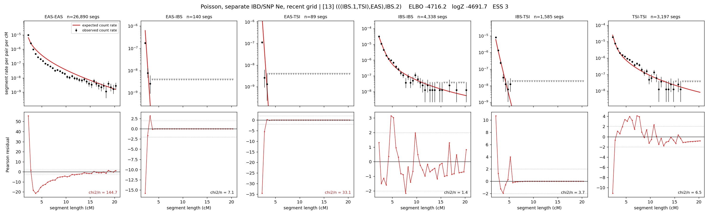

# `(((IBS.1,TSI),EAS),IBS.2)`

**Poisson, separate IBD/SNP Ne, recent grid** | topology 13 of 21 | admixed leaf: **IBS** | 4 events, 8 nodes

> Recent Ne grid: 0-5 and 5-10 generations. The first demographic event is explicitly constrained to occur after generation 10 (minimum 11 with the current one-generation gap).

## Model score

| quantity | value | |
|---|---|---|
| ELBO | -4716.20 | +- 0.26 (MC) |
| logZ (importance sampling) | -4691.72 | |
| ESS of the IS weights | 2.9 / 4000 | LOW -- treat logZ with suspicion |
| Stan dropped-constant correction | -40.81 | already applied |
| mode kept / MAP start / runtime | 1 / 4 | 26 s |
| mode search | 12/12 MAP starts succeeded | 3 distinct modes evaluated |

## Events (in temporal order, most recent first)

| # | type | detail | time (gen) | cumulative |
|---|---|---|---|---|
| 1 | ADMIXTURE | IBS -> IBS.1 + IBS.2 | 91.6 +- 1.1 | 91.6 |
| 2 | MERGE | IBS.2 + TSI -> n1 | 30.2 +- 1.2 | 121.8 |
| 3 | MERGE | n1 + EAS -> n2 | 235.8 +- 6.3 | 357.6 |
| 4 | MERGE | IBS.1 + n2 -> root | 114.0 +- 8.2 | 471.6 |

## Admixture fraction

**f = 0.649 +- 0.003** (fraction from `IBS.1`; 0.351 from `IBS.2`)

## Recent effective sizes for IBD (haploid)

| population | 0-5 gen | 5-10 gen |
|---|---:|---:|
| `EAS` | 73,648,146 | 34,133,880 |
| `IBS` | 1,078,908 | 1,318,525 |
| `TSI` | 1,114,143 | 685,283 |

## Effective sizes for IBD (haploid)

| node | Ne | sd of log Ne |
|---|---|---|
| `EAS` | 955,886 | 0.02 |
| `IBS` | 831,980 | 0.07 |
| `TSI` | 525,772 | 0.05 |
| `IBS.1` | 413,312 | 0.09 |
| `IBS.2` | 3,106 | 0.08 |
| `n1` | 27,866 | 0.05 |
| `n2` | 39 | 0.44 |
| `root` | 5,712 | 0.03 |

log-Ne random-walk step scale tau_ibd = 2.337

## Recent effective sizes for SNP (haploid)

| population | 0-5 gen | 5-10 gen |
|---|---:|---:|
| `EAS` | 2,196 | 2,309 |
| `IBS` | 395,306 | 332,572 |
| `TSI` | 269,398 | 301,413 |

## Effective sizes for SNP (haploid)

| node | Ne | sd of log Ne |
|---|---|---|
| `EAS` | 1,979 | 0.02 |
| `IBS` | 312,047 | 0.03 |
| `TSI` | 292,049 | 0.07 |
| `IBS.1` | 200,631 | 0.05 |
| `IBS.2` | 304,851 | 0.07 |
| `n1` | 210,560 | 0.06 |
| `n2` | 87,611 | 0.04 |
| `root` | 46,945 | 0.04 |

log-Ne random-walk step scale tau_snp = 0.787

## Fit quality by component

| component | log-likelihood | n terms | chi2/n |
|---|---|---|---|
| IBD | -4,452.7 | 222 | 32.86 |
| SNP | +38.8 | 6 | 1.60 |

IBD chi2/n uses Poisson counting variance; SNP chi2/n uses its block SEs. Values near 1 indicate residuals on the modeled noise scale.

## SNP covariance residuals `(w_hat - W_pred)/w_se`

| | EAS | IBS | TSI |
|---|---|---|---|
| **EAS** | -0.01 | +0.19 | -0.18 |
| **IBS** | +0.19 | -0.12 | -0.25 |
| **TSI** | -0.18 | -0.25 | +0.57 |

